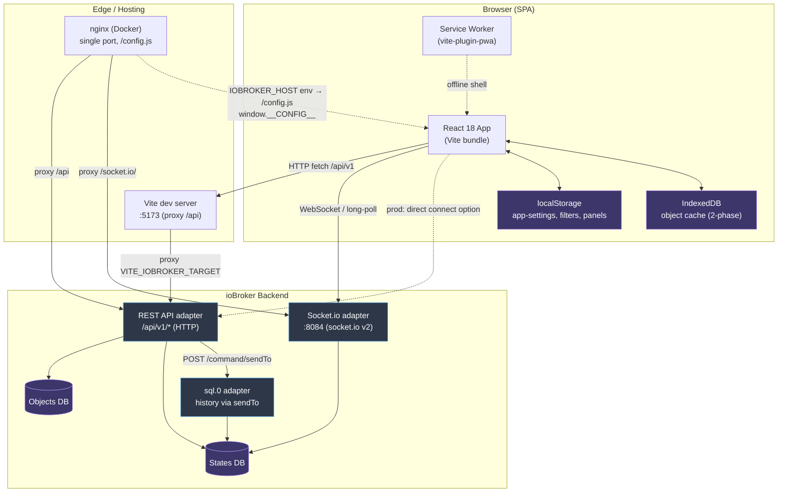
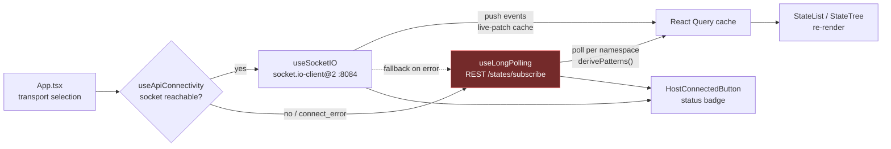
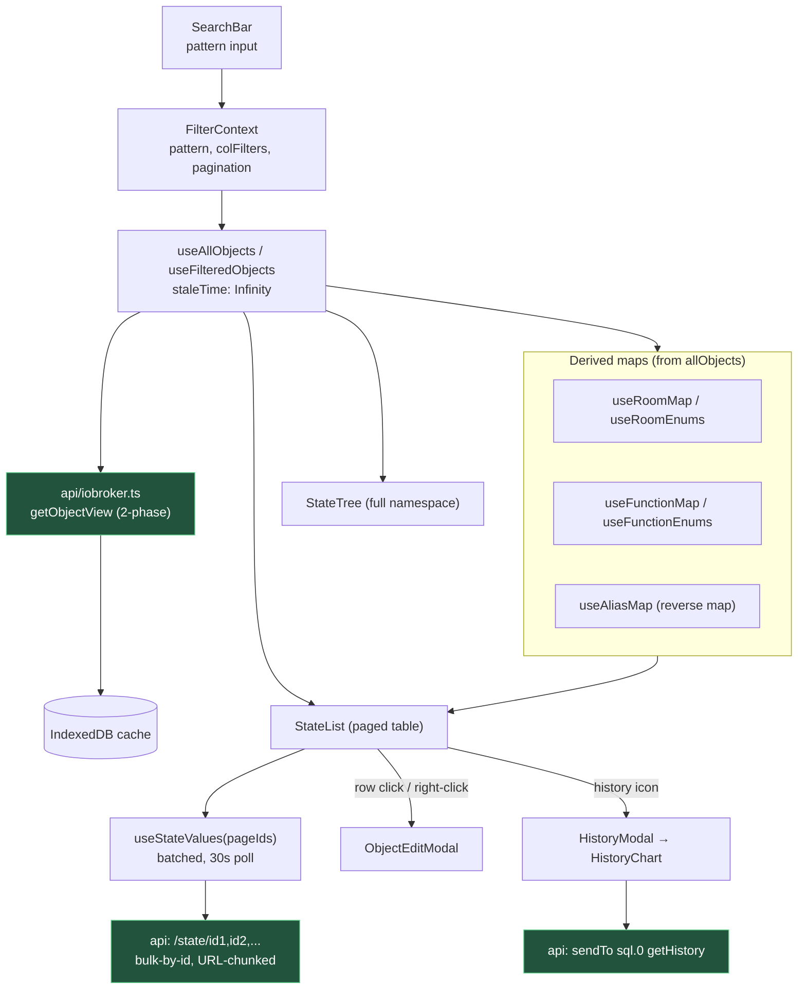
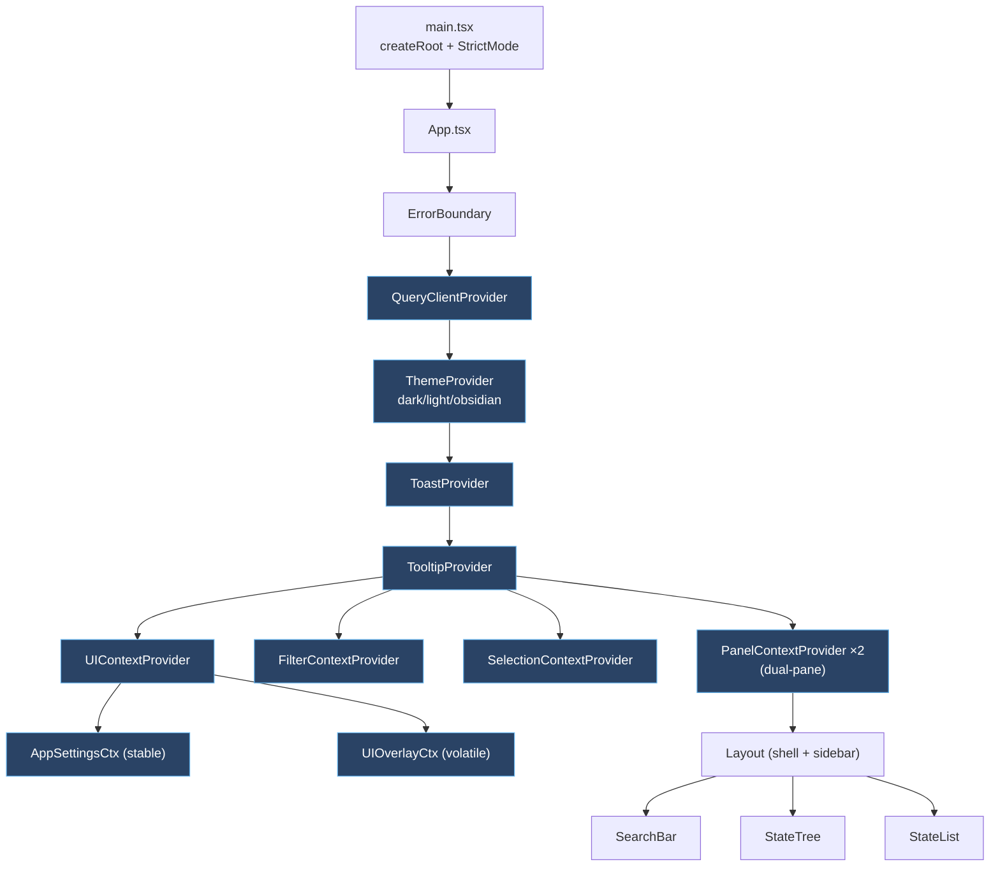
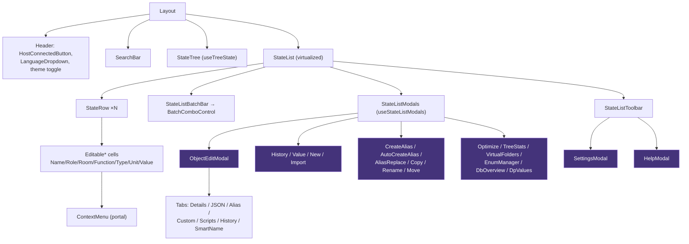
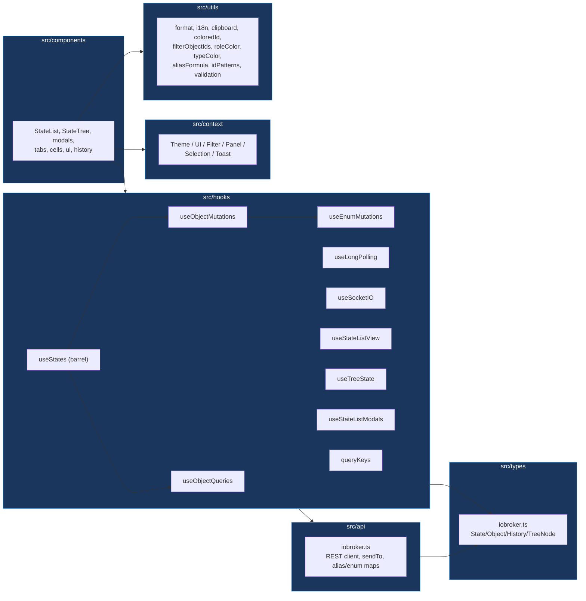
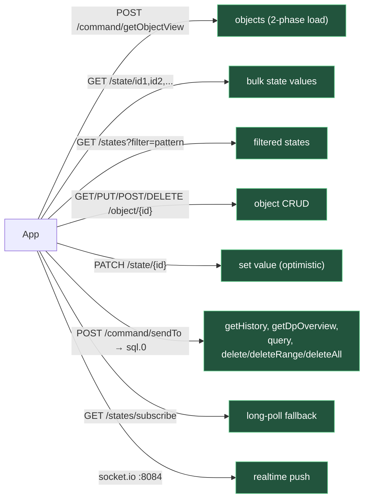

# ioBroker Object Explorer — Architecture

Mermaid diagrams describing the full project and its internal + external relationships.
Generated overview — not authoritative over the code. See [CLAUDE.md](CLAUDE.md) and [API.md](API.md) for detail.

---

## 1. System context (external world)

How the React SPA talks to the outside: ioBroker adapters, browser storage, PWA, Docker.

---

## 2. Realtime transport selection

Socket.io default; auto-fallback to REST long-polling.

> ⚠️ Socket.io path has **no auth** — trusted networks only.

---

## 3. Data flow (query pipeline)

---

## 4. React context / provider tree

---

## 5. Component hierarchy (UI)

---

## 6. Module layers (source map)

---

## 7. External API surface (ioBroker endpoints used)

---

**Stack:** React 18 · TanStack Query v5 · react-virtual · Recharts · Tailwind · Vite · Vitest · socket.io-client v2 · PWA
