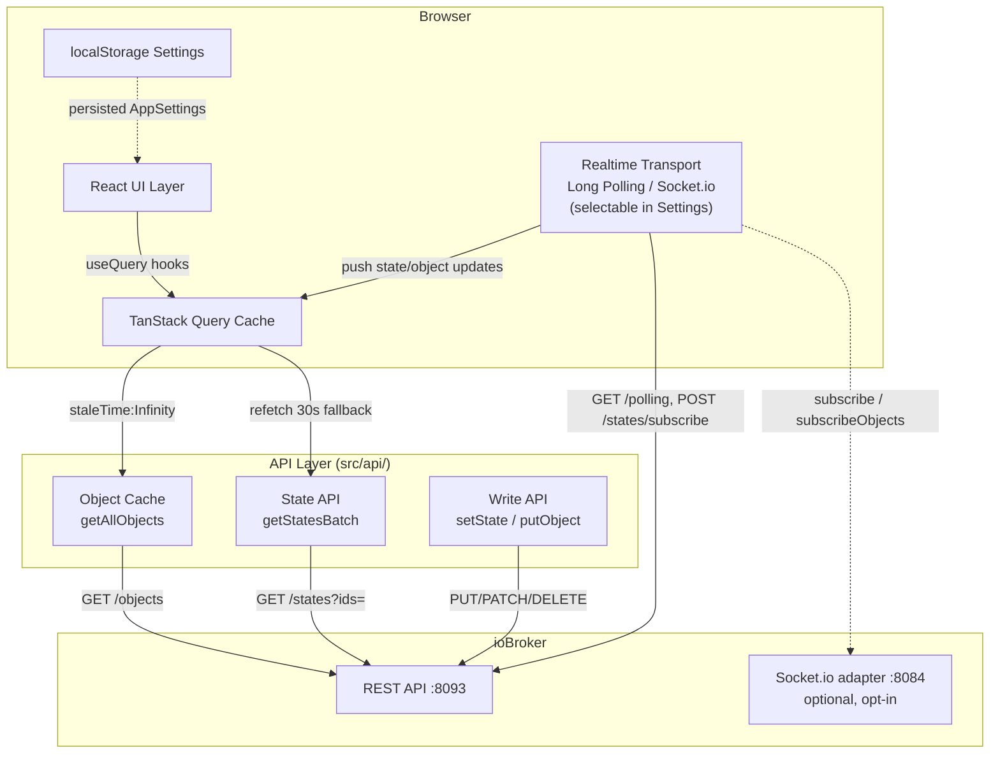

# ioBroker Object Explorer


A React dashboard for browsing, managing, and monitoring ioBroker datapoints.

---

## Getting Started

```bash
npm install
npm run dev        # Dev server on port 5173
```

**Prerequisites:** ioBroker with an active [REST API adapter](https://github.com/ioBroker/ioBroker.rest-api) (port `8093`) with CORS enabled. For history data, only the **`sql.0` adapter** is currently supported.

> **⚠️ No auth support:** Neither the REST API nor the optional Socket.io realtime transport currently support authentication (login/token). Only use this dashboard against ioBroker instances reachable solely from a trusted network — do not expose the REST API or Socket.io adapter to the internet.

The ioBroker address can be configured in the browser via **Settings → Connection**: enter `host:port` and use "Test & Connect" (saved in `localStorage`, reloads on connect). The browser connects directly to the ioBroker REST API (no server-side proxy required).

**Dev server configuration:** Copy `.env.local.example` to `.env.local` and set `VITE_IOBROKER_TARGET`. The Vite dev server proxies `/api` to this address as a fallback when no host is set in the browser.

---

## Docker

The Nginx container proxies `/api` to the ioBroker REST API. `IOBROKER_HOST` is **required** — the container exits on startup if the variable is missing. The entrypoint generates `/config.js` with `window.__CONFIG__`, used as the initial host value in the browser. The host can be changed at any time via Settings → Connection (saved in localStorage).

### docker-compose (recommended)

Copy `docker-compose.yml.example` to `docker-compose.yml`, set your ioBroker IP, then start:

```bash
cp docker-compose.yml.example docker-compose.yml
# edit docker-compose.yml and set IOBROKER_HOST
docker compose up -d --build
```

`docker-compose.yml`:

```yaml
services:
  iobroker-object-explorer:
    container_name: iobroker-object-explorer
    build: .
    ports:
      - "8080:80"
    environment:
      IOBROKER_HOST: 10.4.0.33   # Required — IP of your ioBroker instance
      IOBROKER_PORT: 8093         # Optional, default: 8093
    restart: unless-stopped
```

After the first build, subsequent restarts only need:

```bash
docker compose up -d
```

To rebuild after a code change:

```bash
docker compose up -d --build
```

### Manual docker run

```bash
docker build -t iobroker-object-explorer .
docker run -p 8080:80 \
  -e IOBROKER_HOST=<ip> \
  -e IOBROKER_PORT=8093 \
  iobroker-object-explorer
```

The app is then reachable at `http://localhost:8080`.

---

## Features

### UI Overview

```
┌───────────────────────────────────────────────────────────────────────────────┐
│ Header                                                                        │
│  logo · back/forward · reset filters · connection · theme ·                   │
│  dual-pane toggle · settings · help · fullscreen                              │
├─────────────────────┬─────────────────────────────────────────────────────────┤
│ StateTree           │ Toolbar                                                 │
│ (Sidebar)           │   New · Export · Import · Enums ·                       │
│                     │   Statistics · Optimize · Database · Columns            │
│                     ├─────────────────────────────────────────────────────────┤
│ folder              │ SearchBar                                               │
│  └ device           │   pattern · quick/saved filters ·                       │
│     └ channel       │   history/SmartName/alias badges                        │
│        └ state      │                                                         │
│                     ├─────────────────────────────────────────────────────────┤
│                     │ StateList (virtualized table)                           │
│                     │  StateRow | StateRow | StateRow | ...                   │
│                     │  click/right-click row -> ObjectEditModal               │
│                     ├─────────────────────────────────────────────────────────┤
│                     │ BatchComboControl bar (rows checked)                    │
│                     ├─────────────────────────────────────────────────────────┤
│                     │ Pagination                                              │
└─────────────────────┴─────────────────────────────────────────────────────────┘
```

Resizable drag handle sits between **StateTree** sidebar and main content. In **dual-pane mode** (`Columns2` icon) the right side renders a second independent `Toolbar + SearchBar + StateList` stack side by side.

| Area | Component | Notes |
|---|---|---|
| Header | `Layout.tsx` | App-wide controls, always visible |
| Sidebar | `StateTree.tsx` | Hierarchical object tree, collapsible/resizable |
| Toolbar | `StateListToolbar.tsx` | Bulk actions + column controls |
| Search bar | inside `StateList.tsx` | Pattern input, quick/saved filters |
| Table | `StateList.tsx` + `StateRow.tsx` | Virtualized rows, sortable/resizable columns |
| Batch bar | `BatchComboControl.tsx` | Appears when rows are checked |
| Edit modal | `ObjectEditModal.tsx` | Opens on row click / right-click |

---

### Layout & Navigation

- **Collapsible sidebar**: header button toggles the sidebar open/closed (CSS transition); state persisted in `localStorage`
- **Drag-resize**: divider between sidebar and main area is draggable (180–600 px); width persisted in `localStorage`
- **Fullscreen mode**: Maximize/Minimize button in header; press ESC to exit
- **Theme**: Light / Dark / Obsidian — switchable in Settings, saved in `localStorage`
- **Language toggle**: EN/DE selector in Settings → Display, saved in settings
- **Filter history navigation**: Back / Forward arrow buttons in the header (next to the app title) navigate through the history of applied search filters — works like browser back/forward for filter state
- **Expert mode toggle**: Wrench icon in the header (left of Settings); amber when active
- **Saved filters**: frequently used filter combinations can be named and saved; accessible via the bookmark icon in the search bar; persisted to `localStorage`
- **Connection status**: host badge in the header (left of the version number) shows status + current host with a refresh button; change the host in Settings → Connection

---

### Dual-Pane View

Toggle with the **Columns2** icon in the header. Shows two independent datapoint tables side by side — like a dual-pane file manager (FreeCommander style).

- **Active panel**: click a panel to activate it (blue top border); the sidebar search and tree navigation always target the active panel
- **Tab** key (outside an input field) switches the active panel
- **←/→** arrow keys page through the active panel
- **Independent per panel**: search pattern, page, column filters, tree scope, visible columns, flat/grouped view — all saved independently in `localStorage`
- **Reduced default columns** in dual-pane: ID, Room, Function, Type, Role, Value, Unit (to save horizontal space); each panel's column selection is saved independently
- **Stretch to 100%** is automatically triggered when dual-pane is closed
- **Cross-panel**: right-click → **"Open in other panel"** navigates the other panel to the selected datapoint's namespace
- **Drag & drop to create aliases** (opt-in, dual-pane only): drag a datapoint from one pane onto an `alias.0.*` row or folder/device/channel header in the other to open the Create Alias dialog — see [Drag & drop to create aliases](#drag--drop-to-create-aliases)
- **Reset Filters** button resets both panels simultaneously
- **Hidden column tooltips**: when columns are hidden (e.g. Name, Ack, Timestamp), their values appear highlighted in blue at the top of the row hover tooltip

---

### Search & Filter

- **Pattern search** with wildcard support (e.g. `alias.0.*`, `0_userdata.0.*`)
- **Enum filter syntax**: add `room:"Living Room"` or `function:"Lights"` to the search pattern to filter by room or function
- **Quick filter buttons** for frequently used namespaces in the sidebar
- **Configurable extra quick filters**: additional buttons can be added in Settings
- Empty input matches all objects (`*`)
- **History filter**: shows only datapoints with active history recording (badge with match count)
- **SmartName filter**: shows only datapoints with a configured SmartHome name (badge with match count)
- **Dangling Aliases filter**: shows only `alias.0.*` objects whose target datapoint no longer exists; count badge shows total affected — combine with bulk delete to clean up stale aliases
- Filters can be combined

---

### Object Tree (Sidebar)

- Hierarchical view of the ioBroker object structure (folder / device / channel / datapoint)
- Node types with distinct icons: folder (yellow), device (light blue), channel (indigo), datapoint without history (green), datapoint with history (blue)
- **SmartName indicator**: microphone icon on datapoints with a configured SmartName
- **Magnifier icon** on folders: sets the folder path as search filter and fully expands the tree
- **Copy icon**: copies the ID or pattern (e.g. `folder.*`) to clipboard with visual feedback
- **Expand / Collapse all**: buttons in the sidebar toolbar
- Responds live to history and SmartName filters
- **Right-click context menu**: copy ID, set as filter, edit object, rename, move, delete datapoint; on device/channel nodes: **"Auto-create aliases…"**; on `alias.*` nodes: **"Find & Replace in targets…"**

---

### Datapoint Table

#### Columns

| Column | Description |
|--------|-------------|
| **Checkbox** | Multi-select for bulk actions; show/hide via column picker (default: visible) |
| **+** | Button to create new datapoints (first column, always visible) |
| Write-protected | Lock icon for read-only datapoints |
| History | Clickable history icon — opens the History modal directly |
| SmartName | Microphone icon with SmartName value tooltip |
| Alias | Amber link icon when an alias points to this datapoint; multiple aliases show a count badge; clickable (jumps to alias) |
| ID | Monospace; copy button on hover |
| Name | Inline-editable via pencil icon |
| Room | Derived from `enum.rooms.*`; editable on click (dropdown with all available rooms) |
| Function | Derived from `enum.functions.*`; editable on click (dropdown with all available functions) |
| Role | Inline-editable with autocomplete (portal dropdown) |
| Value | Left-aligned; truncated to 20 chars (tooltip shows full value). Inline indicators: green ▲ / red ▼ trend arrow when a numeric value rose/fell since the last refresh; ⚠ triangle when the value is near (yellow) or outside (red) the `min`/`max` range; pencil (on hover) opens the value editor. Booleans show green (true) / red (false), `null` is greyed out. Editable datapoints with role `switch` render a toggle, role `button` a ⚡ trigger button (non-expert mode); `url` values render as clickable links |
| Unit | Unit of the value |
| Ack | Green (acknowledged) / yellow (unacknowledged) dot |
| Last Update | Timestamp `DD.MM.YYYY HH:MM:SS` |
| **Delete** | Trash icon with confirmation dialog (last column, always visible) |

All data columns (except + and Delete) can be toggled via the **column picker dropdown**. The selection is saved in `localStorage`.

#### Column Management

- **Resize columns**: drag the right edge of a column header (minimum 40 px)
- **Auto-fit**: double-click the column edge to fit to content
- **Stretch to 100%**: expands all content columns to fill the available container width; indicator columns keep their fixed width
- **Reset settings**: restores default widths, visibility, and filters
- Column widths are saved in `localStorage`

#### Sorting & Filtering

- Click a column header to sort ascending or descending (arrow indicator)
- **Column filter row** directly below headers: free-text filter for ID, Name, Room, Function, Role, Value, and Unit
- Icon columns (Write-protected, History, SmartName, Alias) filter by click toggle
- Active filters are highlighted with a blue border; clearable individually via X or all at once via the toolbar

#### Row Actions

- **Click row**: opens ObjectEditModal with live value, object metadata, and edit controls
- **Right-click row**: opens context menu (see below)
- **History icon**: opens the History modal directly
- **Delete icon** (far right): shows confirmation dialog before irreversible deletion
- **Checkbox**: multi-select for bulk delete

#### Right-click Context Menu (Table)

| Entry | Action |
|-------|--------|
| Copy ID | Copy ID to clipboard |
| Copy name | Copy display name to clipboard |
| Copy value | Copy current value to clipboard |
| Show history | Open History modal |
| Set as filter | Set ID as the ID column filter |
| Set as filter & Optimize… | Set ID as filter and immediately open OptimizeModal for that path |
| Edit room | Open room dropdown directly |
| Edit function | Open function dropdown directly |
| Edit value | Open ValueEditModal |
| Edit object | Open ObjectEditModal (Details / JSON / Alias / Custom Settings) |
| Open in other panel | Navigate the other panel to this datapoint's namespace (dual-pane mode only) |
| Copy datapoint | Open copy dialog |
| Rename datapoint | Open rename dialog |
| Move datapoint | Open move dialog |
| Create alias | Open alias dialog (non-`alias.0.*` datapoints only) |
| Delete datapoint | Confirmation dialog for deletion |

#### Toolbar

Left side (action buttons):

| Button | Icon | Description |
|--------|------|-------------|
| **New** |  | Opens dropdown: **New datapoint** () or **New alias** (); ID pre-filled from current search pattern |
| **Export** |  | Dropdown: export filtered datapoints as **JSON file**, **CSV file**, or **JSON to clipboard** |
| **Import** |  | Opens ImportDatapointsModal to import datapoints from a JSON file |
| **Enums** |  | Opens the Enum Manager modal to manage rooms and functions |
| **Statistics** |  | Opens TreeStatsModal — namespace-level statistics table (total objects, states, structure nodes, history-enabled, smart, aliases, scripts) with subtree delete and namespace navigation |
| **Script Index** |  | Rebuilds and shows the script-usage index — which datapoint IDs are referenced by `javascript.0` scripts; cached in `localStorage` for 1 h |
| **Optimize** |  | Opens OptimizeModal — scans datapoints for missing metadata (room, function, role, name, description, unit, min/max, type) and allows bulk-fixing them inline with batch controls |
| **Database** |  | Opens DbOverviewModal — lists all datapoints stored in the `sql.0` database (via `getDpOverview`), with per-row value count, DB-name rename, and history deletion — see [Database Overview](#database-overview-dboverviewmodal) |
| **Alias Replace** |  | Appears when at least one checked row starts with `alias.`; opens Find & Replace in Alias Targets modal pre-filled with the first selected alias target |
| **Auto Alias** |  | Auto-creates aliases for all child states of the current device/channel path (requires tree filter or non-glob ID filter) |
| **History** |  | Opens HistoryModal for 1–2 checked datapoints with history (disabled otherwise) |
| **Delete N** |  | Appears when rows are checked; deletes all selected datapoints after confirmation |

Center: filtered datapoint count.

Right side (view controls):

| Button | Icon | Description |
|--------|------|-------------|
| **Show description** |  | Toggle `common.desc` below name in the Name column |
| **Hide alias sub-rows** |  | Toggle alias source/target sub-rows |
| **Group / Flat view** |  /  | Toggle grouped-by-path vs. flat paginated view |
| **Shorten paths** |  | Toggle abbreviated group headers (only visible in grouped mode) |
| **Stretch 100%** |  | Expand all columns to fill container width |
| **Reset settings** |  | Reset all column widths and settings from `localStorage` |
| **Compact view** |  | Toggle compact row density |
| **Column picker** | dropdown | Show/hide individual table columns |

#### Batch Editing

When one or more rows are checked via the checkbox column, a batch bar appears below the toolbar with combo controls for **Role**, **Unit**, **Room**, and **Function**. Selecting a value applies it to all checked datapoints at once.

#### Pagination

- Configurable page size: **200 / 500 / 1000 / 3000** entries (saved in settings); default 200
- Pagination only active when no filter is applied and **Group by path** is disabled; otherwise all matching rows are shown in a virtualized list
- Footer: Previous · page info (current page, range, total) · Next
- Table uses **virtual rendering** (`@tanstack/react-virtual`) — only visible rows are in the DOM regardless of total row count

---

### Settings Modal

Opened via the gear icon in the header. Changes are applied only on **Save** (draft pattern). Exception: Expert mode and toolbar labels toggles take effect immediately.

**Tab: Connection**

| Setting | Description |
|---------|-------------|
| REST API IP / Port | ioBroker host and REST API adapter port; "Test & Connect" probes connectivity then reloads |
| Admin UI Port | ioBroker Admin port (default 8081); used for object icon URLs and direct admin links |
| Swagger UI link | Opens the REST API adapter's built-in Swagger UI for the configured host |
| Realtime transport | Socket.io (default) / Long Polling (fallback); selects the push transport for live state/object updates — see [Realtime Updates](#realtime-updates--long-polling--socketio) |
| Socket host | Override `host:port` for the Socket.io adapter (default guess: `<restHost>:8084`); only shown when transport is set to Socket.io |

**Tab: Display**

| Setting | Options | Default | Description |
|---------|---------|---------|-------------|
| Theme | Light / Dark / Obsidian | Light | UI color scheme; saved immediately to `localStorage` |
| Language | EN / DE | EN | UI language for labels, dialogs, and tooltips |
| Date format | DD.MM.YYYY · MM/DD/YYYY · YYYY-MM-DD | DD.MM.YYYY | Timestamp display in the Value Last Update column |
| Toolbar button labels | on/off | on | Show/hide text labels next to toolbar icons |
| Table font size | S / M / L / XL | M | Row text size in the datapoint table |
| Rows per page | 200 / 500 / 1000 / 3000 | 200 | Page size for the paginated table view |
| Group table by path | on/off | on | Groups rows by namespace path instead of paginating; uses virtual rendering |
| Description below name | on/off | on | Shows `common.desc` below the name in the Name column |
| Show object icons in Name column | on/off | off | Fetches and shows the adapter icon next to each object name |
| Show type icons | on/off | on | Shows a small type icon (state/device/channel/folder) in the table |
| Animate group expand/collapse | on/off | off | Smooth CSS animation when expanding/collapsing path groups |
| Hide alias source/target lines | on/off | off | Hides the extra sub-rows showing an alias's source/target datapoint beneath the alias row |
| Drag & drop to create aliases | on/off | off | Lets you drag a datapoint row onto an `alias.0.*` row or folder/device/channel header (dual-pane view only) to open the Create Alias dialog pre-filled; off by default to avoid click latency from the native `draggable` attribute — see [Drag & drop to create aliases](#drag--drop-to-create-aliases) |
| Sidebar tree font size | S / M / L / XL | M | Text size in the object tree |
| Tree count badge | Off / Objects / States / Both | Objects | What count is shown in the badge next to each tree node |
| Auto-refresh objects | Off / 30 s / 1 m / 5 m / 10 m | Off | Periodic background re-fetch of the full object cache |
| Reuse cached objects for | Off / 5 / 10 / 20 / 50 reloads | 10 | How many browser reloads reuse the persisted (IndexedDB) objects/scripts payload before refetching; works together with cache TTL — whichever triggers first wins |
| Objects cache TTL | Off / 1h / 6h / 24h / 7d | 24h | Max age of the persisted objects cache before it's considered stale, regardless of the reload counter |
| Fetch state values for visible rows only | on/off | off | Restricts state-value fetching/polling to rows currently scrolled into view (reported by the table virtualizer) instead of the whole page — reduces request size on large pages at the cost of a brief "loading" flicker for newly visible rows |

**Tab: Columns**

- Toggle visibility of each table column individually; at least one must remain visible
- Per-column width customization: set default, min, and max width in px for each configurable column
- "Reset all" reverts to built-in widths

**Tab: Filters**

- Add custom ID patterns (wildcards supported, e.g. `hm-rpc.0.*`) that appear as additional quick-filter buttons in the sidebar
- Remove custom patterns individually; built-in quick filters (Aliases, SmartName, Custom, History, Script) are not affected

---

### Edit Object (ObjectEditModal)

Opened via **row click** or **right-click → "Edit object"** in the table and tree.

- **Details tab**: editable fields (name, type, role, unit, description, min/max, read/write); live value with controls (switch/button/number/boolean/text based on type and role); expert mode (wrench icon) for free-form value input; inline mini history chart when history is active
- **JSON tab**: raw JSON editor with syntax error display; save directly via `PUT`
- **Alias tab**: set or remove alias target; supports **separate read/write IDs** (`alias.id` as `{read, write}`); read/write JS conversion formulas (`alias.read`, `alias.write`) with inline formula tester
- **Custom Settings tab**: edit `common.custom` adapter-specific settings as JSON
- **Header buttons**: expert mode toggle (wrench), delete datapoint (trash)

---

### Create Alias

Opened via **right-click → "Create alias"** (non-`alias.0.*` datapoints only).

- Automatically suggests an alias ID (`alias.0.<source-id-without-adapter-prefix>`)
- Copies type, role, unit, read/write permissions from the source datapoint
- Sets `common.alias.id` to the source ID
- Alias ID must start with `alias.0.` (validated)

#### Drag & drop to create aliases

Enable **"Drag & drop to create aliases"** in Settings → Display (**off by default**). Only active in **dual-pane view**:

- Drag a source datapoint row from one pane and drop it onto a target in the other pane — an `alias.0.*` row, or (in grouped view) a **folder / device / channel** header below `alias.0`
- The drop target is highlighted in green while hovering
- On drop, the Create Alias dialog opens **pre-filled**: target path + the source's leaf name, e.g. dragging `0_userdata.0.test-2` onto `alias.0.test1` suggests `alias.0.test1.test-2`
- Off by default because the native `draggable` attribute can add a slight delay to row clicks

---

### Auto-Create Aliases from Device

Opened via **right-click on a device or channel node → "Auto-create aliases…"** in the tree.

- Enter a **base path** (e.g. `alias.0.Wohnzimmer.Heizung`) — all child state datapoints are listed below it with their suggested alias IDs
- Each row is pre-filled with the source name, type, role, and unit
- Check/uncheck individual datapoints; **All** / **None** buttons for quick selection
- Optionally assign a **Room** and **Function** enum to all created aliases at once
- Creates all selected aliases in sequence; live progress counter; cache invalidated once after all creates

---

### Find & Replace in Alias Targets

Opened via **right-click on an `alias.*` tree node → "Find & Replace in targets…"** or from the header of that context menu.

- Enter an **old string** and a **new string** — all `alias.0.*` objects whose `common.alias.id` contains the old string are shown in a preview table
- Supports both simple string targets (`alias.id`) and dual read/write targets (`alias.id.read` / `alias.id.write`)
- Preview rows show old target in red, new target in green
- **Apply** button updates all affected aliases in sequence with live progress counter
- Useful when replacing a device (e.g. after a HomeMatic device swap: replace `hm-rpc.0.JEQ0698034` → `hm-rpc.0.NEWDEVICE`)

---

### Copy Datapoint

Opened via **right-click → "Copy datapoint"**.

- New ID pre-filled as `<source-id>_copy`; name as `<name> (Copy)`
- Copies: type, role, unit, read/write, min/max, description, states mapping
- **Alias target replacement** (shown automatically for `alias.0.*` sources): enter a find/replace string to rewrite the `common.alias.id` of the copy — live preview of the resulting target ID

---

### Rename Datapoint

Opened via **right-click → "Rename datapoint"**.

- Input pre-selects the last segment of the ID for quick editing
- Validates against existing IDs to prevent duplicates
- Renames both the object and its state

---

### Move Datapoint

Opened via **right-click → "Move datapoint"**.

- Separate inputs for path and name (last segment)
- Validates path format and target ID for conflicts
- Moves both the object and its state

---

### Import Datapoints

Opened via the **Import button** in the toolbar.

- Accepts a JSON file containing an array of ioBroker objects or a single object
- Preview with syntax-highlighted JSON before import
- Reports success/error per datapoint after import

---

### Optimize Datapoints (OptimizeModal)

Opened via **toolbar → Optimize** or **right-click → "Set as filter & Optimize…"**.

- Scans all datapoints under the current filter path and checks for missing metadata
- **Checks performed**: Room missing, Function missing, Role missing, Name missing, Description missing, Unit missing (number types only), Min/Max missing (number types only), Type not set
- Results shown in a table grouped by check type with total and per-check counts
- **Inline batch editing**: select failing datapoints and apply correct values via BatchComboControl (Role, Unit, Room, Function)
- Click a datapoint row to open ObjectEditModal for manual editing
- Re-run the scan after fixes to verify progress

---

### Statistics (TreeStatsModal)

Opened via **toolbar → Statistics**.

- Namespace-level overview table: adapter instance → total objects, states, structure nodes (folders/devices/channels), history-enabled states, SmartName states, aliases, script-referenced IDs
- **Sortable** by any column
- **Click a namespace row** to navigate directly to that namespace in the main table
- **Script Index** toggle: includes or excludes script-referenced ID counts; requires a script index scan (cached 1 h in `localStorage`)
- **Delete subtree**: select a namespace and delete all objects under it with a confirmation dialog and progress indicator

---

### Database Overview (DbOverviewModal)

Opened via **toolbar → Database**.

Lists all datapoints that actually have data stored in the **`sql.0` database** — independent of whether history recording is currently enabled on the object. Useful for spotting orphaned history (values kept for datapoints whose object was renamed or deleted).

- **Header stats**: approximate total value rows across all history tables and total database size (data + index), read instantly from `information_schema.TABLES` (no full-table `COUNT`)
- **Data source**: `sql.0` `getDpOverview` sendTo command; returns each stored datapoint's `id`, `type`, and last-value timestamp (`ts`, shown as local date/time)
- **Type colors**: the `type` column uses the same color coding as the main datapoint table (`getTypeColor`)
- **Stored values** (click an ID): opens DpValuesModal showing the raw value rows for that datapoint (timestamp, value, ack, quality, source), newest first, paginated 20 rows/page. A **from/to timestamp filter** (datetime pickers) narrows the range (`WHERE ts BETWEEN …`). The **value is editable inline** (pencil on hover → raw `UPDATE ts_* SET val WHERE id AND ts`, type-coerced), and single rows can be **deleted** (trash on hover → `delete` by ts). Fast even for large datapoints — resolves the numeric `datapoints.id` first, then a PK-indexed scan on the `ts_*` table (no filesort)
- **Dynamic columns**: derived from the adapter response (robust across adapter versions); `id` first, sortable by any column, free-text filter by ID
- **Value count** (on demand): the **Values** column shows a `#` button per row — click to count that datapoint's stored values (fast, type-specific indexed query on `ts_number`/`ts_string`/`ts_bool`). Header **Count** button counts all currently shown rows sequentially. Full-table counting is intentionally *not* automatic — a `GROUP BY` over the whole `ts_number` table is too slow on large databases (single-datapoint lookups stay fast)
- **Rename in DB** (pencil on row hover): updates `datapoints.name` via a raw `query` `UPDATE`. History is preserved (the `ts_*` tables reference the numeric `datapoints.id`, not the name), and existing target names are rejected. This touches **only the database** — it does not rename the ioBroker object (use [Rename Datapoint](#rename-datapoint) for that)
- **Delete DB values** (trash on row hover): removes all stored values for the datapoint via `deleteAll` (irreversible, with inline confirmation)

> **⚠️ Raw SQL:** Rename and count use the `sql.0` `query` command against the configured database (name defaults to `iobroker`, set in `src/api/iobroker.ts` → `SQL_DB_NAME`). Single quotes in IDs are escaped.

---

### Enum Manager (EnumManagerModal)

Opened via **toolbar → Enums**.

- View and edit all `enum.rooms.*` and `enum.functions.*` objects
- Add new rooms or functions; rename or delete existing ones
- Add/remove datapoint members from any enum directly

---

### History Chart

> **Note:** Only the **`sql.0` adapter** is currently supported for history queries and deletion. Datapoints without an active `sql.0` recording will not show a history icon.

**Time range**
- Presets: 1 h, 6 h, 24 h, 7 d, 30 d, 1 year
- Manual mode: two datetime pickers for a custom range

**Chart types**
- Line (default), Area (with gradient), Bar — switchable via button group

**Display options**
- Toggle data points on/off
- Aggregation: None / Average / Min+Max / Min / Max

**Multi-series comparison**
- Up to 4 additional history-enabled datapoints overlaid on the same time axis
- Each extra series shown in a distinct color with its own legend entry

**Periodic comparison**
- Overlay the same datapoint's values from **1 week ago** or **1 month ago** on the same chart

**Statistics panel**
- Min / Max / Average / Last value shown as badges above the chart

**Zoom & pan**
- **Mouse wheel** zooms the visible time range (centered on cursor)
- **Drag** pans the visible window along the time axis

**Export**
- **PNG export** button downloads the chart as an image file

**Interaction**
- Responsive (fills available width/height)
- Dark/light theme aware
- X-axis: time for ≤ 24 h, otherwise date + time
- Y-axis with unit; hover tooltip with timestamp and value

**Deleting history data**
- **Single value**: activation mode highlights points red; click a point to delete that entry
- **Time range**: deletes all entries in the currently visible time range
- **All**: deletes the entire history for the datapoint
- All actions require confirmation

---

### History Modal

- Large modal (80 vw × 75 vh) with a full-size history chart
- Opened by clicking the history icon in the table
- Header shows the datapoint ID (monospace) + close button
- Close with ESC or click outside

---

### Create New Datapoint

| Field | Required | Description |
|-------|----------|-------------|
| ID | Yes | Pre-filled from search pattern (e.g. `javascript.0.` from `javascript.0.*`); duplicate validation |
| Name | Yes | Display name |
| Type | Yes | number / string / boolean / mixed |
| Unit | No | Free text |
| Role | No | Autocomplete from all known roles |
| Initial value | No | Sets the value immediately after creation |
| Min / Max | No | Number type only |
| Readable / Writable | No | Checkboxes, both enabled by default |

---

### Delete Datapoints

- Trash icon in the last table column (single delete)
- **Bulk delete**: select datapoints via checkbox → delete all with progress indicator
- Confirmation dialog shows the ID(s) to be deleted
- Deletes both the object and state irreversibly via `DELETE /v1/object/:id`

---

### Toast Notifications

Operation feedback (success/error) is displayed as toast messages in the bottom-right corner and auto-dismiss after a few seconds.

---

### Keyboard Shortcuts

Press **`?`** to open the keyboard shortcuts overview.

| Shortcut | Scope | Action |
|----------|-------|--------|
| `Ctrl B` / `Cmd B` | Global | Toggle sidebar |
| `?` | Global | Show keyboard shortcuts modal |
| `Esc` | Global | Close open modal / deselect row |
| `↑` / `↓` | Table focused | Navigate rows up/down |
| `←` / `→` | Table focused | Previous / next page |
| `Enter` | Table focused | Open focused row in ObjectEditModal |
| `Esc` | Column filter | Clear focused column filter input |

---

## Architecture



Realtime updates default to **Socket.io** for low-latency push (requires the `socketio` adapter, port 8084). If the adapter is unreachable, the app automatically falls back to long polling against the standard REST adapter. Long polling can also be selected manually in Settings as the sole transport. See [`CLAUDE.md`](CLAUDE.md) for details on both transports.

---

## Data Flow

```
SearchBar (pattern input)
  → useAllObjects()         — objects loaded once, filtered client-side
  → useStateValues(ids)     — push via targeted long-poll (visible namespaces only); 10 s batch fallback
  → StateList               — paginated, sorted, filtered
  → StateTree               — hierarchical navigation

Row click / Right-click → Edit object
  → ObjectEditModal         — Details / JSON / Alias / Custom Settings tabs

History icon / menu entry
  → HistoryModal            — multi-series chart with zoom, pan, export, comparison

Right-click → Create alias
  → CreateAliasModal        — creates alias.0.* object

Right-click (device/channel) → Auto-create aliases
  → AutoCreateAliasModal    — batch-creates alias.0.* objects for all child states

Right-click (alias.* node) → Find & Replace in targets
  → AliasReplaceModal       — bulk-replaces strings in alias.id across all aliases

Right-click → Copy datapoint
  → CopyDatapointModal      — duplicates datapoint with new ID; alias.0.* sources get optional target path replacement

Right-click → Rename datapoint
  → RenameDatapointModal    — renames object + state to new ID

Right-click → Move datapoint
  → MoveDatapointModal      — moves object + state to new path

Import button
  → ImportDatapointsModal   — imports datapoints from JSON file
```

---

## API Communication

Base URL: `/api/v1` (via Vite dev proxy or Nginx) or `http://{host}/v1` (direct browser connection).

All communication goes through the [ioBroker REST API adapter](https://github.com/ioBroker/ioBroker.rest-api). The app never holds a persistent server-side session — every tab is stateless except for the long-poll `sid` token and the in-memory object cache.

---

### Object Loading Strategy

Objects (the metadata layer — type, name, role, unit, alias, enum membership) are loaded **once at startup** and cached in-memory for the lifetime of the page. They are never re-fetched automatically unless the user triggers a manual refresh or the configurable objects-refresh interval fires.

**Startup sequence (two-phase):**

1. **Phase 1 — fast bootstrap** (`/objects?type=state`): fetches only state objects immediately. The table populates as soon as this returns — typically within a few hundred milliseconds.
2. **Phase 2 — full load** (5 parallel requests): runs right after Phase 1. Merges states + enums + folders + devices + channels into a single in-memory map. The tree and all enum columns become available once this completes.

```
App start
  ├─ GET /objects?type=state          → Phase 1: table visible immediately
  └─ GET /objects                     ┐
     GET /objects?type=enum           │ Phase 2: parallel, merged into
     GET /objects?type=folder         │ global object cache
     GET /objects?type=device         │
     GET /objects?type=channel        ┘
```

All subsequent filtering (search pattern, fulltext, column filters, room/function filters) runs **client-side** against the cached object map — no extra API calls per keystroke or filter change.

| Method | Path | When | Notes |
|--------|------|------|-------|
| GET | `/objects?type=state` | App start (immediately) | Fast bootstrap; populates table before full load |
| GET | `/objects` | App start (parallel with enums/folders/devices/channels) | Full object set |
| GET | `/objects?type=enum` | App start (parallel) | Room and function enums |
| GET | `/objects?type=folder` | App start (parallel) | Folder nodes for the tree |
| GET | `/objects?type=device` | App start (parallel) | Device nodes |
| GET | `/objects?type=channel` | App start (parallel) | Channel nodes |
| GET | `/objects?type=script` | Scripts column active / Scripts modal tab | Script sources for datapoint usage search |
| GET | `/objects?type=instance` | Custom Settings tab open | Instances where `supportCustoms=true` |
| GET | `/object/:id` | ObjectEditModal — Custom tab / fresh fetch | Single object, bypasses cache |
| PUT | `/object/:id` | Save edits, enum membership, rename, import | Full object replace (`PUT` semantics) |
| DELETE | `/object/:id` | Delete single or bulk (up to 8 parallel) | Permanent — no undo |

---

### State Value Loading Strategy

State values (the runtime layer — current value, `ack`, timestamp) are fetched **only for the currently visible page** (default 50 rows). No values are fetched for hidden rows, collapsed tree nodes, or other pages.

**Three-tier fallback** (`getStatesBatch`):

```
Tier 1  GET /states?ids=a,b,...     Single request, ≤ 200 IDs in URL
        ↓ (404 or URL too long)
Tier 2  GET /command/getStates?pattern=*   All states in one call, filtered client-side
        ↓ (not supported)
Tier 3  GET /state/:id × N          Parallel batches of 50 — last resort
```

The app probes Tier 1 on the first call and caches the result (`_bulkStatesSupported`). If the REST API adapter is too old to support `/states?ids=…`, it permanently switches to Tier 2 or 3 for the session — no repeated probing.

| Method | Path | When | Notes |
|--------|------|------|-------|
| GET | `/states?ids=a,b,...` | Fallback poll / visible page | Max 200 IDs per request (URL length limit) |
| GET | `/command/getStates?pattern=*` | Tier 2 fallback | Fetches all states; app filters to requested IDs client-side |
| GET | `/state/:id` | Tier 3 fallback / Edit modal (5 s interval) | 50 parallel per batch |
| PATCH | `/state/:id` | Write value (edit modal, value editor) | Body: `{ val, ack }` |

---

### Realtime Updates — Long-Polling & Socket.io

The app supports two interchangeable push transports for live state/object updates, selectable in **Settings → Connection → Realtime transport**:

- **Socket.io** (default) — connects to a separate `socketio` adapter instance (default port `8084`, requires `socket.io-client@2`/v2.x server) for low-latency push; subscribes per-pattern to both state and object changes (`stateChange`/`objectChange`), live-patching the React Query caches directly. If the adapter is unreachable, the app automatically activates long-polling as a fallback and reflects the *effective* transport in the connection-status badge (amber fallback marker), recovering automatically once Socket.io reconnects.
- **Long Polling** (fallback / manual) — HTTP long-hold against the standard REST API adapter, always available, no extra setup. Activates automatically when Socket.io is unreachable, or can be selected explicitly in Settings.

Both transports share the same `{ supported, connected }` status shape, so the rest of the app (subscription scoping, cache patching, status display) is transport-agnostic. The long-polling path is documented in detail below.

**Long-polling protocol overview:**

```
Browser                                 ioBroker REST API
   │                                          │
   │─ POST /states/subscribe?sid=…  ─────────►│  Register pattern subscriptions
   │◄─ 200 OK ───────────────────────────────│
   │                                          │
   │─ GET /polling?sid=…&connect ────────────►│  Open long-hold connection
   │◄─ "_" (heartbeat, connection ready) ────│
   │                                          │
   │─ GET /polling?sid=… ────────────────────►│  Wait for next event (up to 30 s)
   │◄─ {"id":"…","state":{…}} ───────────────│  Push on state change
   │◄─ "_" (heartbeat, no change in 30 s) ──│  Reconnect immediately
   │                                          │
   │  [page changes]                          │
   │─ POST /states/unsubscribe?sid=… ────────►│  Unsubscribe old patterns
   │─ POST /states/subscribe?sid=… ──────────►│  Subscribe new patterns
   └─ GET /polling?sid=… ────────────────────►│  Continue loop
```

**Targeted subscription — no global `*`:**

Subscriptions are scoped to the `adapter.instance` namespace of each ID currently visible on the page. Given visible IDs like `hm-rpc.0.MEQ1234567.1.STATE` and `alias.0.heating.temp`, the app subscribes `hm-rpc.0.*` and `alias.0.*` — not `*`. This means the ioBroker adapter only forwards changes for those namespaces instead of broadcasting all state changes across the entire installation.

```
Visible IDs on page          →  Subscribe patterns
─────────────────────────────────────────────────
hm-rpc.0.MEQ1234567.1.STATE  →  hm-rpc.0.*
hm-rpc.0.MEQ1234567.1.LOWBAT →  (already covered by hm-rpc.0.*)
alias.0.heating.temp          →  alias.0.*
0_userdata.0.myvar            →  0_userdata.0.*
```

The first pattern is probed sequentially (to detect a 404 unsupported response); remaining patterns are subscribed in parallel. On page change or unmount, all subscribed patterns are unsubscribed in parallel before the new subscribe runs.

**Cache update on push event:**

When the server pushes a state change event, the app updates all active React Query batch caches that contain that ID — the table row updates immediately without a round-trip. The detail modal query (`useStateDetail`) is also updated if that ID is currently open.

**Reconnect on disconnect:**

If the server sends `{ "disconnect": true }` or the connection drops, the app waits 5 s and then restarts the full subscribe → poll loop with a new `sid`.

| Method | Path | When | Notes |
|--------|------|------|-------|
| POST | `/states/subscribe?sid=…&method=polling` | Page load / page change | One call per pattern; first sequential, rest parallel |
| POST | `/states/unsubscribe?sid=…` | Page change / unmount | All old patterns in parallel |
| GET | `/polling?sid=…&connect&timeout=30000` | After subscribe | `&connect` signals first call; server responds with `_` when ready |
| GET | `/polling?sid=…&timeout=30000` | Continuous loop | Server blocks up to 30 s; responds with JSON event or `_` heartbeat |

**Fallback behavior:**

If the REST API adapter returns HTTP 404 on `/states/subscribe` (older adapter versions, or running as a web extension), the long-poll path is disabled for the session. The app falls back to **interval polling every 10 s** using `getStatesBatch` for the visible page IDs only.

| Mode | Trigger | State refresh |
|------|---------|---------------|
| Long-poll active | Subscribe succeeds | Push (sub-second latency); no periodic batch fetch |
| Long-poll unsupported | 404 on subscribe | Batch fetch every 10 s, visible IDs only |

---

### History Queries

History is fetched exclusively from the **`sql.0` adapter** via ioBroker's `sendTo` command mechanism. The History and InfluxDB adapters are not supported.

```
POST /command/sendTo
Body: { "adapterInstance": "sql.0", "command": "getHistory", "message": { "id": "…", "options": { … } } }
```

All history data is treated as immutable once fetched (`staleTime: Infinity`). Re-fetching only happens when the user changes the time range or aggregation in the modal.

| Method | Path | Command | Purpose |
|--------|------|---------|---------|
| POST | `/command/sendTo` | `getHistory` | Fetch time-series data for the selected range and aggregation |
| POST | `/command/sendTo` | `delete` | Delete a single history entry by timestamp |
| POST | `/command/sendTo` | `deleteRange` | Delete all entries in the visible time window |
| POST | `/command/sendTo` | `deleteAll` | Delete entire history for the datapoint |
| POST | `/command/sendTo` | `getDpOverview` | List all datapoints stored in the DB (Database Overview modal) |
| POST | `/command/sendTo` | `query` | Raw SQL — value count per datapoint and DB-name rename (`UPDATE datapoints`) |

---

### Write Operations

All writes go directly to the REST API. React Query optimistic updates (`onMutate`) apply the new value to the cache immediately — the table row reflects the change before the server confirms. On error the cache is rolled back to the previous value.

| Operation | Method | Path | Notes |
|-----------|--------|------|-------|
| Write state value | PATCH | `/state/:id` | `{ val, ack }` — optimistic update in table |
| Create / update object | PUT | `/object/:id` | Full object replace; cache invalidated after |
| Delete object | DELETE | `/object/:id` | Single or batch of 8 parallel; both object and state deleted |
| Rename / move | PUT old + DELETE old | `/object/:id` | New ID created, old ID deleted; state copied |

---

## Local Storage

| Key | Contents |
|-----|----------|
| `iobroker-app-settings` | Full `AppSettings` object: language, dateFormat, visibleCols, extraQuickFilters, toolbarLabels, pageSize, tableFontSize, treeFontSize, treeCountMode, showDesc, groupByPath, treeViewMode, adminPort, customDefaultWidths, customMinWidths, customMaxWidths, objectsRefreshInterval, includeScripts, shortenGroupPaths, showObjectIcons, showObjectTypeIcons, animateGroupExpand |
| `iobroker-expert-mode` | Expert mode on/off (`"true"` / `"false"`) |
| `iobroker-col-widths` | Column widths in px per column key |
| `iobroker-filter-state` | Last active filter state (pattern, historyOnly, smartOnly, page, colFilters, roomFilters, functionFilters, quickPatterns, treeFilter, …) — restored on reload |
| `iobroker-saved-filters` | Array of named saved filter snapshots (name + full filter state) |
| `iobroker-explorer-sidebar-width` | Sidebar width in px |
| `iobroker-explorer-sidebar-collapsed` | Sidebar collapsed state (`"true"` / `"false"`) |
| `ioBrokerHost` | Last configured ioBroker host string (`ip:port`) |
| `iob-script-used-ids-v1` | JSON array of datapoint IDs referenced in javascript.0 scripts (script index cache) |
| `iob-script-used-ids-ts` | Unix timestamp of when the script index was last built (1 h TTL) |
| `theme` | `"light"`, `"dark"`, or `"obsidian"` |

---

## Project Structure

| Path | Contents |
|------|----------|
| `src/types/iobroker.ts` | TypeScript interfaces (IoBrokerState, IoBrokerObject, …) |
| `src/api/iobroker.ts` | REST API client with global object cache, alias reverse map, enum helpers |
| `src/hooks/useStates.ts` | Re-export barrel (useObjectMutations + useEnumMutations) |
| `src/hooks/useObjectQueries.ts` | React Query hooks (objects, states, history, room/function enums, CRUD) |
| `src/hooks/useObjectMutations.ts` | Mutation hooks for object CRUD (create, update, delete, rename, move) |
| `src/hooks/useEnumMutations.ts` | Mutation hooks for enum membership (room/function add/remove) |
| `src/hooks/useSocketIO.ts` | Socket.io realtime transport (state + object change subscriptions, diff-based resubscribe) |
| `src/hooks/useLongPolling.ts` | Targeted long-poll subscribe/unsubscribe loop; `derivePatterns()` helper |
| `src/hooks/useStateListModals.ts` | State and handlers for all modals opened from StateList/StateTree |
| `src/hooks/useStateListView.ts` | Sorting, filtering, grouping, pagination logic extracted from StateList |
| `src/hooks/useTreeState.ts` | Tree expand/collapse state and logic for StateTree |
| `src/hooks/useColumnResize.ts` | Drag-to-resize column logic with `localStorage` persistence |
| `src/hooks/useBatchEdit.ts` | Batch edit state and mutation logic for checked rows |
| `src/hooks/useApiConnectivity.ts` | Online/offline detection and periodic connectivity probe |
| `src/hooks/useEscapeKey.ts` | Shared ESC key handler for modals |
| `src/hooks/queryKeys.ts` | Centralized React Query key factory |
| `src/context/ThemeContext.tsx` | Light/dark mode context with localStorage persistence |
| `src/context/ToastContext.tsx` | Toast notification context |
| `src/context/FilterContext.tsx` | Search pattern, filters, pagination, saved filters, filter history |
| `src/context/SelectionContext.tsx` | Selected ID, open modal tracking |
| `src/context/UIContext.tsx` | AppSettings, expert mode, script index state; persists to `localStorage` |
| `src/context/PanelContext.tsx` | Per-panel context for dual-pane mode (colFilters, pattern, treeFilter, fulltextEnabled) |
| `src/components/Layout.tsx` | App shell: header, collapsible sidebar, drag-resize |
| `src/components/SearchBar.tsx` | Pattern search input with wildcard support |
| `src/components/StateTree.tsx` | Hierarchical object tree with context menu |
| `src/components/HostConnectedButton.tsx` | Connection status badge in header with host input |
| `src/components/LanguageDropdown.tsx` | EN/DE language selector |
| `src/components/TypeIcon.tsx` | Object type icon component |
| `src/components/statelist/StateList.tsx` | Main table: columns, sorting, filters, context menu, pagination, batch edit bar, threshold highlighting |
| `src/components/statelist/StateListToolbar.tsx` | Toolbar extracted from StateList (New, Export, Import, Enums, Statistics, Optimize, Database, Script Index) |
| `src/components/statelist/StateRow.tsx` | Individual virtualized table row |
| `src/components/statelist/BatchComboControl.tsx` | Combo dropdown used in batch edit bar and OptimizeModal |
| `src/components/statelist/StateListColumns.ts` | Column definitions, keys, labels, default widths |
| `src/components/statelist/StateListConstants.ts` | Virtual row height, overscan, fixed column widths |
| `src/components/statelist/StateListUtils.ts` | Pure utility functions (name extraction, threshold check, …) |
| `src/components/history/HistoryChart.tsx` | Recharts chart with time range, aggregation, multi-series, zoom/pan, periodic comparison, stats, export PNG, delete functions |
| `src/components/history/HistoryChartUtils.ts` | Chart helper utilities (aggregation, data processing) |
| `src/components/modals/ObjectEditModal.tsx` | Edit modal shell (tabs: Details, JSON, Alias, Custom Settings, Scripts); opened on row click and via context menu |
| `src/components/modals/HistoryModal.tsx` | Full-size history modal with extra series management (up to 4 additional datapoints) |
| `src/components/modals/NewDatapointModal.tsx` | Form for creating new datapoints |
| `src/components/modals/CreateAliasModal.tsx` | Dialog for creating a single alias datapoint |
| `src/components/modals/AutoCreateAliasModal.tsx` | Batch-create aliases for all child states of a device/channel |
| `src/components/modals/AliasReplaceModal.tsx` | Find & Replace in alias target IDs across all `alias.0.*` objects |
| `src/components/modals/CopyDatapointModal.tsx` | Dialog for copying datapoints; includes alias target replacement for `alias.0.*` sources |
| `src/components/modals/RenameDatapointModal.tsx` | Dialog for renaming a datapoint ID |
| `src/components/modals/MoveDatapointModal.tsx` | Dialog for moving a datapoint to a new path |
| `src/components/modals/ImportDatapointsModal.tsx` | Dialog for importing datapoints from JSON |
| `src/components/modals/ValueEditModal.tsx` | Standalone modal for editing a datapoint value |
| `src/components/modals/ConfirmDialog.tsx` | Generic confirmation dialog |
| `src/components/modals/MultiDeleteDialog.tsx` | Bulk delete dialog with progress |
| `src/components/modals/EnumManagerModal.tsx` | Room and function enum manager |
| `src/components/modals/OptimizeModal.tsx` | Metadata quality scanner with inline batch fix controls |
| `src/components/modals/TreeStatsModal.tsx` | Namespace statistics table with subtree delete and script index |
| `src/components/modals/DbOverviewModal.tsx` | Lists datapoints stored in the `sql.0` database (getDpOverview); per-row value count, DB rename, history delete |
| `src/components/modals/HelpModal.tsx` | In-app help / feature overview |
| `src/components/modals/SettingsModal.tsx` | All settings tabs (Connection, Display, Columns, Filters) |
| `src/components/modals/StateListModals.tsx` | Modal container rendered within StateList context |
| `src/components/tabs/DetailsTab.tsx` | Details tab of ObjectEditModal (editable fields + live value + mini history chart) |
| `src/components/tabs/AliasTab.tsx` | Alias tab; supports separate read/write IDs and JS conversion formulas with inline tester |
| `src/components/tabs/JsonTab.tsx` | Raw JSON editor tab |
| `src/components/tabs/CustomTab.tsx` | `common.custom` adapter settings tab |
| `src/components/tabs/ScriptsTab.tsx` | Shows javascript.0 scripts that reference the current datapoint ID |
| `src/components/ui/ContextMenu.tsx` | Portal-based right-click menu |
| `src/components/ui/ColPicker.tsx` | Column visibility picker dropdown |
| `src/components/ui/SortHeader.tsx` | Sortable column header with resize handle |
| `src/components/ui/StyledCheckbox.tsx` | Styled checkbox used in table rows and batch bar |
| `src/components/ui/TsRangeFilterControl.tsx` | Timestamp range filter input for the Last Update column |
| `src/components/ui/ToastContainer.tsx` | Toast notification renderer |
| `src/components/ui/IdSuggestInput.tsx` | ID input with autocomplete suggestions from known object IDs |
| `src/components/cells/EditableNameCell.tsx` | Inline-editable Name cell |
| `src/components/cells/EditableRoleCell.tsx` | Role cell with autocomplete portal dropdown |
| `src/components/cells/EditableRoomCell.tsx` | Room cell with portal dropdown |
| `src/components/cells/EditableFunctionCell.tsx` | Function cell with portal dropdown |
| `src/components/cells/EditableValueCell.tsx` | Value cell with inline editor |
| `src/components/cells/EditableUnitCell.tsx` | Unit cell (searchable dropdown) |
| `src/components/cells/EditableTypeCell.tsx` | Type cell |
| `src/components/cells/CopyIdButton.tsx` | Copy-to-clipboard button for ID cells |
| `vite.config.ts` | Dev server + API proxy; reads `VITE_IOBROKER_TARGET` from `.env.local` |
| `nginx.conf` | Nginx config for Docker (SPA fallback, REST API proxy, Socket.io proxy on `/socket.io/`) |
| `Dockerfile` | Multi-stage build (Node 22 → Nginx Alpine) |
| `docker/entrypoint.sh` | Generates `/config.js` from `IOBROKER_HOST` / `IOBROKER_PORT` on container start; exits if `IOBROKER_HOST` is missing |
