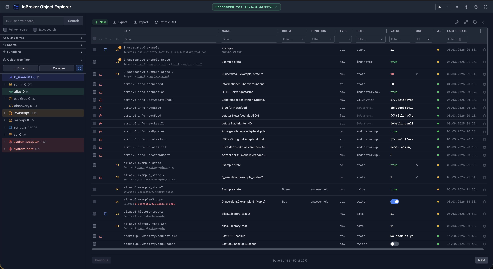

# ioBroker Object Explorer



A React dashboard for browsing, managing, and monitoring ioBroker datapoints via the REST API. Light/dark theme, EN/DE UI language.

**Stack:** React 18 · TypeScript · TanStack React Query · Recharts · Tailwind CSS · Vite

---

## Getting Started

```bash
npm install
npm run dev        # Dev server on port 5173
npm run build      # TypeScript check + production build
npm run lint       # ESLint
npx tsc --noEmit   # Type check only
```

**Prerequisites:** ioBroker with an active [REST API adapter](https://github.com/ioBroker/ioBroker.rest-api) (port `8093`) with CORS enabled. For history data, only the **`sql.0` adapter** is supported (History and InfluxDB adapters are not detected).

The ioBroker address can be configured directly in the browser: click the connection badge in the header → enter `host:port` → press Enter. The browser connects directly to the ioBroker REST API (no server-side proxy required).

**Dev server configuration:** Copy `.env.local.example` to `.env.local` and set `VITE_IOBROKER_TARGET`. The Vite dev server proxies `/api` to this address as a fallback when no host is set in the browser.

---

## Docker

The Nginx container proxies `/api` to the ioBroker REST API. `IOBROKER_HOST` is **required** — the container exits on startup if the variable is missing. The entrypoint generates `/config.js` with `window.__CONFIG__`, used as the initial host value in the browser. The host can be changed at any time via the header badge (saved in localStorage).

### docker-compose (recommended)

Copy `docker-compose.yml.example` to `docker-compose.yml`, set your ioBroker IP, then start:

```bash
cp docker-compose.yml.example docker-compose.yml
# edit docker-compose.yml and set IOBROKER_HOST
docker compose up -d --build
```

`docker-compose.yml`:

```yaml
services:
  iobroker-object-explorer:
    container_name: iobroker-object-explorer
    build: .
    ports:
      - "8080:80"
    environment:
      IOBROKER_HOST: 10.4.0.33   # Required — IP of your ioBroker instance
      IOBROKER_PORT: 8093         # Optional, default: 8093
    restart: unless-stopped
```

After the first build, subsequent restarts only need:

```bash
docker compose up -d
```

To rebuild after a code change:

```bash
docker compose up -d --build
```

### Manual docker run

```bash
docker build -t iobroker-object-explorer .
docker run -p 8080:80 \
  -e IOBROKER_HOST=<ip> \
  -e IOBROKER_PORT=8093 \
  iobroker-object-explorer
```

The app is then reachable at `http://localhost:8080`.

---

## Features

### Layout & Navigation

- **Collapsible sidebar**: header button toggles the sidebar open/closed (CSS animation)
- **Drag-resize**: divider between sidebar and main area is draggable (180–600 px)
- **Fullscreen mode**: Maximize/Minimize button in header; press ESC to exit
- **Light/dark mode**: toggle button in header, saved in `localStorage`
- **Language toggle**: EN/DE selector in header, saved in settings

---

### Search & Filter

- **Pattern search** with wildcard support (e.g. `alias.0.*`, `0_userdata.0.*`)
- **Enum filter syntax**: add `room:"Living Room"` or `function:"Lights"` to the search pattern to filter by room or function
- **Quick filter buttons** for frequently used namespaces in the sidebar
- **Configurable extra quick filters**: additional buttons can be added in Settings
- Empty input matches all objects (`*`)
- **History filter**: shows only datapoints with active history recording (badge with match count)
- **SmartName filter**: shows only datapoints with a configured SmartHome name (badge with match count)
- Both filters can be combined

---

### Object Tree (Sidebar)

- Hierarchical view of the ioBroker object structure (folder / device / channel / datapoint)
- Node types with distinct icons: folder (yellow), device (light blue), channel (indigo), datapoint without history (green), datapoint with history (blue)
- **SmartName indicator**: microphone icon on datapoints with a configured SmartName
- **Magnifier icon** on folders: sets the folder path as search filter and fully expands the tree
- **Copy icon**: copies the ID or pattern (e.g. `folder.*`) to clipboard with visual feedback
- **Expand / Collapse all**: buttons in the sidebar toolbar
- Responds live to history and SmartName filters
- **Right-click context menu**: copy ID, set as filter, edit object, rename, move, delete datapoint

---

### Datapoint Table

#### Columns

| Column | Description |
|--------|-------------|
| **Checkbox** | Multi-select for bulk actions; show/hide via column picker (default: visible) |
| **+** | Button to create new datapoints (first column, always visible) |
| Write-protected | Lock icon for read-only datapoints |
| History | Clickable history icon — opens the History modal directly |
| SmartName | Microphone icon with SmartName value tooltip |
| Alias | Amber link icon when an alias points to this datapoint; multiple aliases show a count badge; clickable (jumps to alias) |
| ID | Monospace; copy button on hover |
| Name | Inline-editable via pencil icon |
| Room | Derived from `enum.rooms.*`; editable on click (dropdown with all available rooms) |
| Function | Derived from `enum.functions.*`; editable on click (dropdown with all available functions) |
| Role | Inline-editable with autocomplete (portal dropdown) |
| Value | Right-aligned; truncated to 16 chars (tooltip shows full value); yellow/red highlight when value is outside `min`/`max` range |
| Unit | Unit of the value |
| Ack | Green (acknowledged) / yellow (unacknowledged) dot |
| Last Update | Timestamp `DD.MM.YYYY HH:MM:SS` |
| **Delete** | Trash icon with confirmation dialog (last column, always visible) |

All data columns (except + and Delete) can be toggled via the **column picker dropdown**. The selection is saved in `localStorage`.

#### Column Management

- **Resize columns**: drag the right edge of a column header (minimum 40 px)
- **Auto-fit**: double-click the column edge to fit to content
- **Stretch to 100%**: expands all content columns to fill the available container width; indicator columns keep their fixed width
- **Reset settings**: restores default widths, visibility, and filters
- Column widths are saved in `localStorage`

#### Sorting & Filtering

- Click a column header to sort ascending or descending (arrow indicator)
- **Column filter row** directly below headers: free-text filter for ID, Name, Room, Function, Role, Value, and Unit
- Icon columns (Write-protected, History, SmartName, Alias) filter by click toggle
- Active filters are highlighted with a blue border; clearable individually via X or all at once via the toolbar

#### Row Actions

- **Click row**: opens ObjectEditModal with live value, object metadata, and edit controls
- **Right-click row**: opens context menu (see below)
- **History icon**: opens the History modal directly
- **Delete icon** (far right): shows confirmation dialog before irreversible deletion
- **Checkbox**: multi-select for bulk delete

#### Right-click Context Menu (Table)

| Entry | Action |
|-------|--------|
| Copy ID | Copy ID to clipboard |
| Copy name | Copy display name to clipboard |
| Copy value | Copy current value to clipboard |
| Show history | Open History modal |
| Set as filter | Set ID as column filter |
| Edit room | Open room dropdown directly |
| Edit function | Open function dropdown directly |
| Edit value | Open ValueEditModal |
| Edit object | Open ObjectEditModal (Details / JSON / Alias) |
| Copy datapoint | Open copy dialog |
| Rename datapoint | Open rename dialog |
| Move datapoint | Open move dialog |
| Create alias | Open alias dialog (non-`alias.0.*` datapoints only) |
| Delete datapoint | Confirmation dialog for deletion |

#### Toolbar

- **+ button** (left): opens the new datapoint form; ID pre-filled from the current search pattern
- **Import button**: opens ImportDatapointsModal to import datapoints from JSON
- **Export button**: exports current filtered datapoints as JSON
- **Count display**: centered — shows total number of filtered datapoints
- **Stretch 100%**, **Clear filters**, **Reset settings**, **Column picker**: right-aligned

#### Batch Editing

When one or more rows are checked via the checkbox column, a batch bar appears below the toolbar with combo controls for **Role**, **Unit**, **Room**, and **Function**. Selecting a value applies it to all checked datapoints at once.

#### Pagination

- Configurable page size: 25 / 50 / 100 / 200 / 500 entries (saved in settings)
- Footer: Back + size selector left · page info centered · Next right

---

---

### Edit Object (ObjectEditModal)

Opened via **row click** or **right-click → "Edit object"** in the table and tree.

- **Details tab**: editable fields (name, type, role, unit, description, min/max, read/write); live value with controls (switch/button/number/boolean/text based on type and role); expert mode (wrench icon) for free-form value input; inline mini history chart when history is active
- **JSON tab**: raw JSON editor with syntax error display; save directly via `PUT`
- **Alias tab**: set or remove alias target; supports **separate read/write IDs** (`alias.id` as `{read, write}`); read/write JS conversion formulas (`alias.read`, `alias.write`) with inline formula tester
- **Custom Settings tab**: edit `common.custom` adapter-specific settings as JSON
- **Header buttons**: expert mode toggle (wrench), delete datapoint (trash)

---

### Create Alias

Opened via **right-click → "Create alias"** (non-`alias.0.*` datapoints only).

- Automatically suggests an alias ID (`alias.0.<source-id-without-adapter-prefix>`)
- Copies type, role, unit, read/write permissions from the source datapoint
- Sets `common.alias.id` to the source ID
- Alias ID must start with `alias.0.` (validated)

---

### Copy Datapoint

Opened via **right-click → "Copy datapoint"**.

- New ID pre-filled as `<source-id>_copy`; name as `<name> (Copy)`
- Copies: type, role, unit, read/write, min/max, description, states mapping

---

### Rename Datapoint

Opened via **right-click → "Rename datapoint"**.

- Input pre-selects the last segment of the ID for quick editing
- Validates against existing IDs to prevent duplicates
- Renames both the object and its state

---

### Move Datapoint

Opened via **right-click → "Move datapoint"**.

- Separate inputs for path and name (last segment)
- Validates path format and target ID for conflicts
- Moves both the object and its state

---

### Import Datapoints

Opened via the **Import button** in the toolbar.

- Accepts a JSON file containing an array of ioBroker objects or a single object
- Preview with syntax-highlighted JSON before import
- Reports success/error per datapoint after import

---

### History Chart

> **Note:** Only the **`sql.0` adapter** is currently supported for history queries and deletion. Datapoints without an active `sql.0` recording will not show a history icon.

**Time range**
- Presets: 1 h, 6 h, 24 h, 7 d, 30 d, 1 year
- Manual mode: two datetime pickers for a custom range

**Chart types**
- Line (default), Area (with gradient), Bar — switchable via button group

**Display options**
- Toggle data points on/off
- Aggregation: None / Average / Min+Max / Min / Max

**Multi-series comparison**
- Up to 4 additional history-enabled datapoints overlaid on the same time axis
- Each extra series shown in a distinct color with its own legend entry

**Periodic comparison**
- Overlay the same datapoint's values from **1 week ago** or **1 month ago** on the same chart

**Statistics panel**
- Min / Max / Average / Last value shown as badges above the chart

**Zoom & pan**
- **Mouse wheel** zooms the visible time range (centered on cursor)
- **Drag** pans the visible window along the time axis

**Export**
- **PNG export** button downloads the chart as an image file

**Interaction**
- Responsive (fills available width/height)
- Dark/light theme aware
- X-axis: time for ≤ 24 h, otherwise date + time
- Y-axis with unit; hover tooltip with timestamp and value

**Deleting history data**
- **Single value**: activation mode highlights points red; click a point to delete that entry
- **Time range**: deletes all entries in the currently visible time range
- **All**: deletes the entire history for the datapoint
- All actions require confirmation

---

### History Modal

- Large modal (80 vw × 75 vh) with a full-size history chart
- Opened by clicking the history icon in the table
- Header shows the datapoint ID (monospace) + close button
- Close with ESC or click outside

---

### Create New Datapoint

| Field | Required | Description |
|-------|----------|-------------|
| ID | Yes | Pre-filled from search pattern (e.g. `javascript.0.` from `javascript.0.*`); duplicate validation |
| Name | Yes | Display name |
| Type | Yes | number / string / boolean / mixed |
| Unit | No | Free text |
| Role | No | Autocomplete from all known roles |
| Initial value | No | Sets the value immediately after creation |
| Min / Max | No | Number type only |
| Readable / Writable | No | Checkboxes, both enabled by default |

---

### Delete Datapoints

- Trash icon in the last table column (single delete)
- **Bulk delete**: select datapoints via checkbox → delete all with progress indicator
- Confirmation dialog shows the ID(s) to be deleted
- Deletes both the object and state irreversibly via `DELETE /v1/object/:id`

---

### Toast Notifications

Operation feedback (success/error) is displayed as toast messages in the bottom-right corner and auto-dismiss after a few seconds.

---

### Keyboard Shortcuts

Press **`?`** to open the keyboard shortcuts overview.

| Shortcut | Action |
|----------|--------|
| `Ctrl B` / `Cmd B` | Toggle sidebar |
| `?` | Show keyboard shortcuts |
| `Esc` | Close modal / deselect |
| `↑` / `↓` | Navigate rows in table (click table area first) |
| `←` / `→` | Previous / next page |
| `Enter` | Open focused row (ObjectEditModal) |

---

## Data Flow

```
SearchBar (pattern input)
  → useAllObjects()         — objects loaded once, filtered client-side
  → useStateValues(ids)     — batch fetch for current page (30 s polling)
  → StateList               — paginated, sorted, filtered
  → StateTree               — hierarchical navigation

Row click / Right-click → Edit object
  → ObjectEditModal         — Details / JSON / Alias / Custom Settings tabs

History icon / menu entry
  → HistoryModal            — multi-series chart with zoom, pan, export, comparison

Right-click → Create alias
  → CreateAliasModal        — creates alias.0.* object

Right-click → Copy datapoint
  → CopyDatapointModal      — duplicates datapoint with new ID

Right-click → Rename datapoint
  → RenameDatapointModal    — renames object + state to new ID

Right-click → Move datapoint
  → MoveDatapointModal      — moves object + state to new path

Import button
  → ImportDatapointsModal   — imports datapoints from JSON file
```

---

## API Endpoints

| Method | Path | Description |
|--------|------|-------------|
| GET | `/v1/objects` | Load all objects |
| GET | `/v1/object/:id` | Single object |
| PUT | `/v1/object/:id` | Create / fully replace object |
| PATCH | `/v1/object/:id` | Partially update object (extend) |
| DELETE | `/v1/object/:id` | Delete object |
| GET | `/v1/state/:id` | Load single state |
| PATCH | `/v1/state/:id` | Set state |
| POST | `/v1/command/sendTo` | Query / delete history data via `sql.0` |

---

## Local Storage

| Key | Contents |
|-----|----------|
| `iobroker-app-settings` | All app settings (language, dateFormat, visibleCols, extraQuickFilters, toolbarLabels, pageSize) |
| `iobroker-expert-mode` | Expert mode on/off |
| `iobroker-col-widths` | Column widths |
| `theme` | `dark` or `light` |

---

## Project Structure

| Path | Contents |
|------|----------|
| `src/types/iobroker.ts` | TypeScript interfaces (IoBrokerState, IoBrokerObject, …) |
| `src/api/iobroker.ts` | REST API client with global object cache, alias reverse map, enum helpers |
| `src/hooks/useStates.ts` | React Query hooks (objects, states, history, room/function enums, CRUD) |
| `src/context/ThemeContext.tsx` | Light/dark mode context with localStorage persistence |
| `src/context/ToastContext.tsx` | Toast notification context |
| `src/components/Layout.tsx` | App shell: header, collapsible sidebar, drag-resize |
| `src/components/SearchBar.tsx` | Pattern search input with wildcard support |
| `src/components/StateTree.tsx` | Hierarchical object tree with context menu |
| `src/components/StateList.tsx` | Main table: columns, sorting, filters, context menu, pagination, batch edit bar, threshold highlighting |
| `src/components/ObjectEditModal.tsx` | Edit modal (Details / JSON / Alias / Custom Settings tabs); opened on row click and via context menu |
| `src/components/HistoryChart.tsx` | Recharts chart with time range, aggregation, multi-series, zoom/pan, periodic comparison, stats, export PNG, delete functions |
| `src/components/HistoryModal.tsx` | Full-size history modal with extra series management (up to 4 additional datapoints) |
| `src/components/NewDatapointModal.tsx` | Form for creating new datapoints |
| `src/components/CreateAliasModal.tsx` | Dialog for creating alias datapoints |
| `src/components/CopyDatapointModal.tsx` | Dialog for copying datapoints |
| `src/components/RenameDatapointModal.tsx` | Dialog for renaming a datapoint ID |
| `src/components/MoveDatapointModal.tsx` | Dialog for moving a datapoint to a new path |
| `src/components/ImportDatapointsModal.tsx` | Dialog for importing datapoints from JSON |
| `src/components/ValueEditModal.tsx` | Standalone modal for editing a datapoint value |
| `src/components/KeyboardShortcutsModal.tsx` | Keyboard shortcuts overview modal |
| `src/components/LanguageDropdown.tsx` | EN/DE language selector |
| `src/components/ToastContainer.tsx` | Toast notification renderer |
| `src/components/ContextMenu.tsx` | Portal-based right-click menu |
| `src/components/ConfirmDialog.tsx` | Generic confirmation dialog |
| `src/components/MultiDeleteDialog.tsx` | Bulk delete dialog with progress |
| `vite.config.ts` | Dev server + API proxy; reads `VITE_IOBROKER_TARGET` from `.env.local` |
| `nginx.conf` | Nginx config for Docker (SPA fallback, API proxy) |
| `Dockerfile` | Multi-stage build (Node 22 → Nginx Alpine) |
| `docker/entrypoint.sh` | Generates `/config.js` from `IOBROKER_HOST` / `IOBROKER_PORT` on container start; exits if `IOBROKER_HOST` is missing |
