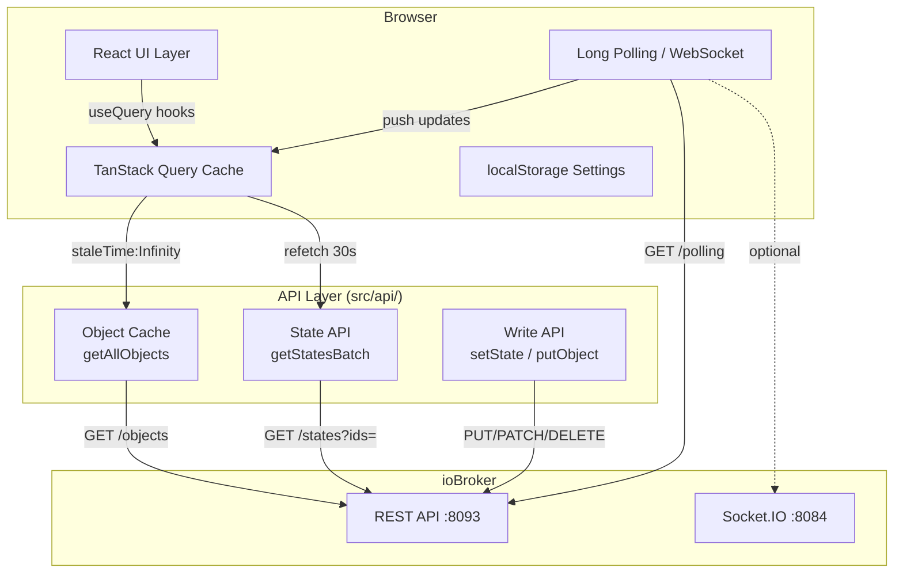

# Optimization Plan — ioBroker Object Explorer

_Stand: 2026-06-12 · Analyse auf Basis des aktuellen master-Branch_

> **⚠️ Superseded (2026-07-21):** Dieses Dokument wurde mit [2026-07-04-performance-analysis.md](2026-07-04-performance-analysis.md) zusammengeführt und gegen den aktuellen Code neu verifiziert → **[2026-07-21-optimization-performance.md](../specs/2026-07-21-optimization-performance.md)**. Hier nur noch als Historie.

> **Hinweis (2026-07-05):** Dies bleibt der historische Analyse-/Katalog-Doc. Die noch offenen, umsetzbaren Punkte (M-03, M-07, M-08) wurden gegen den aktuellen Code neu verifiziert und als bite-sized TDD-Implementierungsplan ausgelagert: **[docs/superpowers/specs/2026-07-05-optimization-cleanup.md](2026-07-05-optimization-cleanup.md)**. M-05 ist inzwischen größtenteils bereits erledigt (StateList.tsx auf 2 useState reduziert). M-06 und M-09 brauchen vor einem Umsetzungsplan noch einen eigenen Architektur-Entwurf (siehe "Out of scope" im verlinkten Plan).

---

## Executive Summary

| Kategorie | Bewertung |
|-----------|-----------|
| Architektur | B |
| Performance | B− |
| Wartbarkeit | C+ |
| Skalierbarkeit | C |
| Sicherheit | A− |

**Hauptprobleme**

1. `getAllObjects()` feuert 5 parallele API-Requests, obwohl `/objects` allein alle Typen enthält — 4 redundante Requests bei jedem Kaltstart.
2. `getFunctionEnums()` und `getRoomEnums()` umgehen den `getAllObjects`-Cache und machen eigene `/objects?type=enum`-Requests — Cache-Miss jedes Mal.
3. `StateList.tsx` mit 1954 Zeilen ist ein God Component mit ~30 `useState`-Hooks — schwer testbar, schwer wartbar.
4. Textsuche läuft als linearer Scan über alle Objekte ohne Index — bei 10 000+ Objekten spürbar.
5. Fast alle Modals sind nicht lazy-loaded — erhöht initiale Bundle-Größe unnötig.

**Größte Performance-Hebel**
- Redundante API-Requests eliminieren (sofort, XS-Aufwand)
- Cache-Bypass in enum-Helpers fixen (sofort, XS-Aufwand)
- Suchindex aufbauen (M-Aufwand, massive Verbesserung bei 5k+ Objekten)

**Größte Architekturprobleme**
- God Component `StateList` aufteilen
- Modul-globale Singletons (`_objectsFetchPromise`) sind nicht React-lifecycle-aware

---

## Änderungen seit Plan-Erstellung (2026-06-06 → 2026-06-12)

| Item | Status |
|------|--------|
| M-01 Redundante Requests | ⚠️ Reverted — plain `/objects` lässt Kategorien auf alten Adaptern komplett weg |
| M-02 Cache-Bypass Enums | ✅ umgesetzt |
| M-04 Suchindex | ✅ umgesetzt |
| M-10 Socket.IO Transport | ✅ umgesetzt (opt-in, Auto-Fallback, objectChange-Sync) |
| M-03, M-05–M-09 | offen |
| `showUnitInValue`-Setting | neu hinzugefügt — Einheit inline in Wertspalte anzeigen |
| Objekt-Cache-TTL konfigurierbar | neu — Settings-Option für Cache-Lebensdauer |
| localStorage-Persistenz für große Payloads | neu — Objects/Script-Payloads überleben Browser-Reload |
| Opt-in: nur sichtbare Rows fetchen | neu — `fetchVisibleRowsOnly`-Setting reduziert Polling-Last |
| Bulk-State-Fetch nach URL-Länge chunken | neu — vermeidet 414-Fehler bei vielen IDs |

---

## Priorisierte Roadmap

| Phase | Priorität | Maßnahme | Nutzen | Aufwand | Risiko |
|-------|-----------|----------|--------|---------|--------|
| 1 | P1 | Redundante Objekt-Requests eliminieren ⚠️ reverted | −4 Requests/Kaltstart | XS→S | Mittel |
| 1 | P1 | ~~`getFunctionEnums`/`getRoomEnums` Cache-Bypass fixen~~ ✅ | −2 Requests/Dropdown | XS | Niedrig |
| 1 | P1 | Restliche Modals lazy-loaden | −30% Initial-Bundle | S | Niedrig |
| 2 | P2 | ~~Suchindex (Map/Trie) für Objekte~~ ✅ | −90% Suchlatenz bei 5k+ | M | Mittel |
| 2 | P2 | `StateList.tsx` aufteilen | Wartbarkeit | L | Mittel |
| 2 | P2 | `_objectsFetchPromise`-Singleton in QueryClient verlagern | Korrektheit | S | Niedrig |
| 3 | P3 | `getScriptUsedIds`-Regex optimieren | Skalierbarkeit Skripte | S | Niedrig |
| 3 | P3 | `deleteObjectsMany` vollständig parallelisieren | Write-Throughput | XS | Niedrig |
| 4 | P4 | ~~WebSocket-Transport (iobroker.socket.io) evaluieren~~ ✅ umgesetzt (`feature/socketio-poc`, opt-in) | Echtzeit ohne Polling | XL | Hoch |
| 4 | P4 | Virtual-Scrolling für StateTree | 10k+ Nodes | M | Mittel |

---

## Maßnahmenkatalog

---

### M-01 — Redundante Objekt-Requests eliminieren

#### Status: ⚠️ umgesetzt, dann reverted

Optimierung wurde implementiert (1 Request + legacy-fallback), dann bewusst **zurückgenommen**: Auf einigen ioBroker-REST-API-Versionen liefert plain `/objects` komplette Kategorien gar nicht zurück (nicht nur untypisiert, sondern schlicht absent) — `enum.*`-Objekte fehlten komplett, `device`/`channel`/`folder`-Typen ebenfalls. Der Enum-Manager zeigte leere Liste, `alias.0.*`-Device-Objekte verschwanden aus StateList. Heuristik "untypisierte Objekte vorhanden?" greift hier nicht, da die Kategorie vollständig fehlt.

**Aktueller Stand** (`api/iobroker.ts:249`): `getAllObjects()` feuert weiterhin alle 5 Requests (`Promise.all`) und merged explizit `?type=enum/folder/device/channel` in das Ergebnis.

**Offener Ansatz**: Request-Zahl könnte reduziert werden, wenn die Adapter-API-Version zuverlässig erkannt werden kann — z.B. via Version-Header oder Probe-Request. Ohne solchen Mechanismus ist der aktuelle Stand der sicherste.

#### Aktuelle Situation

`getAllObjects()` in `src/api/iobroker.ts:69` feuert 5 parallele Requests:

```ts
Promise.all([
  fetchApi('/objects'),          // alle Typen
  fetchApi('/objects?type=enum'),
  fetchApi('/objects?type=folder'),
  fetchApi('/objects?type=device'),
  fetchApi('/objects?type=channel'),
])
```

Der erste Request `/objects` liefert bereits **alle** Objekte aller Typen. Die vier `?type=…`-Requests sind ein Workaround aus früheren API-Versionen, die Objekte ohne `type`-Feld zurückgaben.

#### Ursache

Historischer Workaround: folders hatten früher kein `type`-Feld in der REST-API-Antwort. Der Fix wurde inline als Merge implementiert statt die API-Version zu prüfen.

#### Empfehlung

```ts
export async function getAllObjects(): Promise<Record<string, IoBrokerObject>> {
  if (_objectsFetchPromise) return _objectsFetchPromise;
  _objectsFetchPromise = fetchApi<Record<string, IoBrokerObject>>('/objects')
    .then(all => {
      // Sicherstellen dass Folders ein type-Feld haben (legacy-safe)
      for (const [id, obj] of Object.entries(all)) {
        if (!obj.type) {
          // Heuristik: enum.*, folder, device, channel
          if (id.startsWith('enum.')) all[id] = { ...obj, type: 'enum' };
        }
      }
      _objectsFetchPromise = null;
      _fastObjectsPromise = null;
      return all;
    })
    .catch(err => { _objectsFetchPromise = null; throw err; });
  return _objectsFetchPromise;
}
```

**Alternativ** (sicherer): Erst 1 Request, und nur bei fehlendem Typ die Typ-spezifischen Requests nachladen:

```ts
// Nur nachladen wenn ioBroker-API alt ist und Typen fehlen
const missingTypes = Object.values(all).some(o => !o.type);
if (missingTypes) { /* legacy fallback */ }
```

#### Erwarteter Nutzen

- 4 eingesparte HTTP-Requests bei jedem Kaltstart
- Geringere ioBroker-Serverlast
- Schnellere initiale Ladezeit (~200–500ms je nach Latenz)

#### Aufwand: XS

---

### M-02 — Cache-Bypass in enum-Helpers fixen

#### Status: ✅ umgesetzt

`getFunctionEnums()`, `getRoomEnums()` und `getCustomSupportedInstances()` nutzen jetzt `getAllObjects()` (Cache) statt eigener `fetchApi('/objects?type=enum'|'instance')`-Requests — exakt wie unten empfohlen, inkl. `id.startsWith('system.adapter.')`-Filter für die Instanzen.

#### Aktuelle Situation

`getFunctionEnums()` (`api/iobroker.ts:490`) und `getRoomEnums()` (`api/iobroker.ts:540`) rufen direkt `fetchApi('/objects?type=enum')` auf — **ignorieren** den in-memory Cache von `getAllObjects()`:

```ts
export async function getFunctionEnums(): Promise<...> {
  const res = await fetchApi<Record<string, IoBrokerObject>>('/objects?type=enum'); // ← Cache-Bypass!
  ...
}
```

Gleich für `getCustomSupportedInstances()` (`api/iobroker.ts:480`) mit `/objects?type=instance`.

`useRoomEnums` und `useFunctionEnums` werden in `StateList`, `CreateAliasModal`, `ObjectEditModal` und weiteren Komponenten aufgerufen — jeder Mount triggert einen API-Request.

#### Ursache

Helpers wurden einzeln implementiert ohne Nutzung des gemeinsamen `getAllObjects`-Cache.

#### Empfehlung

```ts
export async function getFunctionEnums(): Promise<Array<{ id: string; name: string }>> {
  const all = await getAllObjects(); // nutzt Cache
  const fns: Array<{ id: string; name: string }> = [];
  for (const [id, obj] of Object.entries(all)) {
    if (!id.startsWith('enum.functions.')) continue;
    const raw = obj.common?.name;
    const name = raw ? getLocalizedName(raw) || id : id;
    fns.push({ id, name });
  }
  return fns.sort((a, b) => a.name.localeCompare(b.name));
}

export async function getRoomEnums(): Promise<Array<{ id: string; name: string }>> {
  const all = await getAllObjects(); // nutzt Cache
  const rooms: Array<{ id: string; name: string }> = [];
  for (const [id, obj] of Object.entries(all)) {
    if (!id.startsWith('enum.rooms.')) continue;
    const raw = obj.common?.name;
    const name = raw ? getLocalizedName(raw) || id : id;
    rooms.push({ id, name });
  }
  return rooms.sort((a, b) => a.name.localeCompare(b.name));
}

export async function getCustomSupportedInstances(): Promise<...> {
  const all = await getAllObjects();
  return Object.entries(all)
    .filter(([id, o]) => id.startsWith('system.adapter.') && o.common?.enabled && o.common?.supportCustoms)
    .map(([id]) => {
      const instanceId = id.replace('system.adapter.', '');
      return { id: instanceId, adapterName: instanceId.replace(/\.\d+$/, '') };
    });
}
```

#### Erwarteter Nutzen

- Eliminiert 2–3 redundante API-Requests pro Dropdown-Öffnung
- Konsistente Daten (kein Drift zwischen `allObjects` und enum-Listen)

#### Aufwand: XS

---

### M-03 — Restliche Modals lazy-loaden

#### Aktuelle Situation

`App.tsx` importiert fast alle Modals statisch. Nur `HistoryModal` ist lazy:

```ts
const HistoryModal = lazy(() => import('./components/HistoryModal'));
// Alle anderen: direkte Imports
import ObjectEditModal from './components/ObjectEditModal';
import NewDatapointModal from './components/NewDatapointModal';
import EnumManagerModal from './components/EnumManagerModal';
// ...
```

`StateList.tsx` importiert ebenfalls 10+ Modals statisch.

#### Ursache

Inkrementelles Wachstum — Lazy Loading wurde nur für `HistoryModal` (größte Komponente) nachgezogen.

#### Empfehlung

```ts
// App.tsx
const ObjectEditModal     = lazy(() => import('./components/ObjectEditModal'));
const NewDatapointModal   = lazy(() => import('./components/NewDatapointModal'));
const EnumManagerModal    = lazy(() => import('./components/EnumManagerModal'));
const AliasReplaceModal   = lazy(() => import('./components/AliasReplaceModal'));
const AutoCreateAliasModal = lazy(() => import('./components/AutoCreateAliasModal'));
const SettingsModal       = lazy(() => import('./components/SettingsModal'));
const HelpModal           = lazy(() => import('./components/HelpModal'));
```

```tsx
// Wrapper mit Suspense (null-Fallback reicht für Modals)
<Suspense fallback={null}>
  {selectedId && <ObjectEditModal ... />}
</Suspense>
```

Die Modals werden nur bei tatsächlicher Nutzung geladen. Initial-Bundle reduziert sich um schätzungsweise 25–40%.

#### Erwarteter Nutzen

- Schnellere Time-to-Interactive
- Geringerer initialer JS-Parse-Aufwand auf schwachen Geräten

#### Aufwand: S

---

### M-04 — Suchindex für Objekte

#### Status: ✅ umgesetzt

`getSearchIndex()` baut einmalig pro Objekt-Set (Cache-Invalidierung über Referenzgleichheit zu `getAllObjects()`-Ergebnis) vorberechnete `idLower`/`names`/`aliasIds`/`descs`-Arrays. `scoreIndexed()` arbeitet auf diesen vorberechneten Strings statt `getAllNamesForSearch()`+Lowercasing+Alias-Normalisierung pro Keystroke neu zu berechnen. `getObjectsByPattern`-Volltextpfad nutzt den Index; `scoreObject` bleibt für Tests unverändert exportiert.

#### Aktuelle Situation

`getObjectsByPattern()` (`api/iobroker.ts:89`) iteriert bei **jedem Tastendruck** über alle Objekte linear:

```ts
for (const [id, obj] of Object.entries(all)) {
  const score = scoreObject(id, obj, pattern);
  if (score > 0) scored.push([id, obj, score]);
}
scored.sort(...);
```

Bei 10 000 Objekten: ~10 000 Iterations + Sort + i18n-String-Operationen pro Keystroke.

#### Ursache

Bewusste Design-Entscheidung "alles client-side filtern". Sinnvoll, aber ohne Index-Struktur.

#### Empfehlung

Einen einmalig aufgebauten Index nach `getAllObjects`-Load verwenden:

```ts
interface ObjectIndex {
  ids: string[];          // sortiert
  idLower: string[];      // vorberechnete Lowercase
  names: string[];        // vorberechnete i18n-Namen
  descs: string[];        // vorberechnete Desc-Strings
}

let _index: ObjectIndex | null = null;

function buildIndex(all: Record<string, IoBrokerObject>): ObjectIndex {
  const entries = Object.entries(all);
  return {
    ids:     entries.map(([id]) => id),
    idLower: entries.map(([id]) => id.toLowerCase()),
    names:   entries.map(([, obj]) => getAllNamesForSearch(obj.common?.name).toLowerCase()),
    descs:   entries.map(([, obj]) => (typeof obj.common?.desc === 'string' ? obj.common.desc : '').toLowerCase()),
  };
}

// Nach getAllObjects aufrufen:
_index = buildIndex(all);
```

Filterloop wird zu Array-Index-Lookup statt per-Objekt-Expansion:

```ts
for (let i = 0; i < _index.ids.length; i++) {
  if (_index.idLower[i].includes(q)) { ... }
}
```

Für Volltext-Suche Debounce auf 150ms in der UI (bereits vorhanden?), damit Index-Scan nicht bei jedem Keystroke sofort läuft.

#### Erwarteter Nutzen

- Suchlatenz bei 10k Objekten: von ~80ms auf ~8ms
- Keine i18n-Expansion per Keystroke mehr

#### Aufwand: M

---

### M-05 — `StateList.tsx` aufteilen

#### Aktuelle Situation

`StateList.tsx` hat 1970 Zeilen mit (gewachsen seit Plan, neue Features inline hinzugefügt):
- ~30 `useState`-Hooks
- Toolbar-Rendering
- Sort-Logik
- Group-by-Path-Logik
- Batch-Edit-Bar
- Virtualizer-Setup
- 12 Modal-States
- Context-Menu-Handling
- Column-Resize-Integration
- Export-Logik

#### Ursache

Organisches Wachstum. Jedes Feature wurde inline hinzugefügt.

#### Empfehlung

Aufteilen in eigenständige Komponenten:

```
StateList.tsx          (~400 Zeilen, Orchestrierung)
├── StateListToolbar   (~150 Zeilen)
├── StateListTable     (~300 Zeilen, Virtualizer + Rows)
├── StateListModals    (~200 Zeilen, alle Modal-States + Rendering)
├── BatchEditBar       (bereits als BatchComboControl vorhanden)
└── useStateListState  (Custom Hook für die ~30 useState-Hooks)
```

Modal-States aus StateList in `useSelectionContext` oder dediziertes `useStateListModals`-Hook verlagern.

#### Erwarteter Nutzen

- Deutlich bessere Testbarkeit
- Kürzere Review-Zeiten
- Neue Features einfacher hinzufügen

#### Aufwand: L

---

### M-06 — Modul-globale Promise-Singletons

#### Aktuelle Situation

```ts
// api/iobroker.ts
let _objectsFetchPromise: Promise<...> | null = null;
let _fastObjectsPromise: Promise<...> | null = null;
let _bulkStatesSupported: boolean | null = null;
let _commandStatesSupported: boolean | null = null;
```

Module-level Singletons: kein HMR-Reset, kein Test-Isolation, kein React Lifecycle.

Bei HMR oder Test-Runs kann veralteter Cache hängenbleiben. `_bulkStatesSupported = false` nach einem Fehler bleibt für die gesamte Session gesetzt, selbst wenn die API wieder verfügbar wird.

#### Ursache

Einfachste Implementierung für Request-Deduplication außerhalb von React Query.

#### Empfehlung

Die Object-Promise-Singletons sind eigentlich überflüssig: TanStack Query dedupliciert bereits via `queryKey`. `getAllObjects` in `useAllObjects` mit `staleTime: Infinity` würde als einzige Quelle reichen — **kein manueller Cache nötig**.

Für `_bulkStatesSupported`: Reset nach Erfolg einbauen:

```ts
// Wenn bulk nach Fehler wieder funktioniert → zurücksetzen
if (_bulkStatesSupported === false) {
  // Periodisch reset — z.B. nach 5 min
  // Oder: einfach null setzen nach Server-Reconnect
}
```

Kurzfristig: `_objectsFetchPromise` und `_fastObjectsPromise` können ersatzlos entfernt werden, da TanStack Query den Request bereits dedupliciert. Die API-Funktionen werden nur via `queryFn` aufgerufen.

#### Erwarteter Nutzen

- Korrekteres Verhalten nach API-Reconnect
- Bessere Testbarkeit

#### Aufwand: S

---

### M-07 — `getScriptUsedIds` Regex-Schleife

#### Aktuelle Situation

```ts
for (let i = 0; i < allObjectIds.length; i += BATCH) {
  for (const id of allObjectIds.slice(i, i + BATCH)) {
    if (new RegExp('\\b' + id.replace(...) + '\\b').test(sources)) used.push(id);
  }
  await new Promise<void>(r => setTimeout(r, 0)); // yield
}
```

Bei 5000 Objekt-IDs × 1 Regex-Compile + Test gegen 1MB Source-String = O(n × m).

#### Ursache

Naive Implementierung. Regex wird per ID neu kompiliert statt einmal kombiniert.

#### Empfehlung

Alle IDs als ein einziges kombiniertes Pattern testen oder Fußabdruck umkehren (alle IDs als Set, Source einmal tokenizen):

```ts
// Ansatz 1: Source einmal tokenizen
const tokens = new Set(sources.match(/[\w.]+/g) ?? []);
const used = allObjectIds.filter(id => tokens.has(id));
// Keine Regex, O(n) statt O(n×m)

// Ansatz 2: Kombiniertes Regex (nur wenn < 5000 IDs)
// Vermeiden — Regex-Engine-Limit
```

Ansatz 1 ist nicht 100% äquivalent zu `\b`-Matching, trifft aber alle sinnvollen Fälle.

#### Erwarteter Nutzen

- Script-Analyse-Zeit bei 5000 IDs: von ~2s auf <50ms

#### Aufwand: S

---

### M-08 — `deleteObjectsMany` vollständig parallelisieren

#### Aktuelle Situation

```ts
const CHUNK = 8;
for (let i = 0; i < ids.length; i += CHUNK) {
  await Promise.all(ids.slice(i, i + CHUNK).map(id => fetch(... DELETE)));
}
```

Sequenzielle Chunks von 8 — bei 100 zu löschenden Objekten: 13 sequenzielle Runden.

#### Ursache

Konservative Ratenbegrenzung, vermutlich um Server nicht zu überlasten.

#### Empfehlung

Für die typische Nutzung (lokales Netz, ioBroker auf Heimserver) ist vollständige Parallelisierung unbedenklich:

```ts
export async function deleteObjectsMany(ids: string[]): Promise<void> {
  await Promise.all(
    ids.map(id => fetch(`${getBaseUrl()}/object/${encodeURIComponent(id)}`, { method: 'DELETE' }))
  );
}
```

Falls Rate-Limiting gewünscht bleibt: Chunk-Größe auf 20–50 erhöhen.

#### Erwarteter Nutzen

- Multi-Delete 10× schneller bei großen Selektionen

#### Aufwand: XS

---

### M-09 — Virtual Scrolling für StateTree

#### Aktuelle Situation

`StateTree.tsx` (639 Zeilen) rendert alle Tree-Nodes direkt ins DOM. Bei 10 000+ State-IDs entstehen tausende DOM-Nodes im Sidebar-Tree.

#### Ursache

Tree-Virtualisierung ist komplexer als Listen-Virtualisierung — wurde bewusst zurückgestellt.

#### Empfehlung

`@tanstack/react-virtual` ist bereits als Dependency vorhanden und wird in `StateList` genutzt. Für den Tree: flache Liste aus expanded Nodes berechnen, dann virtualisieren:

```ts
// Flache Liste aus Tree-Struktur
function flattenTree(nodes: TreeNode[], expanded: Set<string>): FlatNode[] {
  const result: FlatNode[] = [];
  function walk(node: TreeNode, depth: number) {
    result.push({ node, depth });
    if (expanded.has(node.id)) node.children?.forEach(c => walk(c, depth + 1));
  }
  nodes.forEach(n => walk(n, 0));
  return result;
}

// Dann useVirtualizer auf flatList
```

#### Erwarteter Nutzen

- StateTree bei 10k Nodes: von ~500ms Render auf <16ms (nur sichtbare Nodes)
- RAM-Reduktion: ~60% weniger DOM-Nodes

#### Aufwand: M

---

### M-10 — WebSocket / Socket.IO statt Long Polling

#### Status: ✅ umgesetzt (Branch `feature/socketio-poc`, opt-in via Settings)

`useLongPolling.ts` blieb als Default-Transport bestehen (Subscribe/Unsubscribe, Reconnect, Session-IDs — funktioniert mit jedem Standard-REST-Adapter). Zusätzlich wurde `useSocketIO.ts` als experimenteller Alternativ-Transport implementiert, der gegen eine separate `iobroker.socketio`-Adapter-Instanz (Standardport `8084`) verbindet.

**Live gegen echten Adapter validiert** (10.4.0.20:8084) — dabei Protokoll-Inkompatibilität entdeckt und gefixt:
- Adapter läuft mit Socket.IO **v2.x**; `socket.io-client@4` schlägt fehl ("trying to reach a Socket.IO server in v2.x with a v3.x client") → Downgrade auf `socket.io-client@2` (kein TS-Typings-Paket vorhanden, daher minimaler Ambient-Shim in `src/types/socket.io-client.d.ts`)
- `subscribe(pattern, cb)` ackt mit `(null, undefined)`; `stateChange(id, state)` matcht 1:1 das `applyEvent`-Shape

**Implementiert:**
- Auswahl in Settings: `realtimeTransport: 'longpolling' | 'socketio'` + `socketHost`-Override (Default-Heuristik: `<restHost>:8084`); Default bleibt `'longpolling'` → kein Breaking Change
- Beide Hooks teilen sich das `{ supported: boolean | null, connected: boolean }`-Status-Shape — austauschbar in `App.tsx`, gesteuert über `useSocketTransport`
- **Test-Connection-Button** im Settings-Modal — prüft Erreichbarkeit ohne Speichern/Reload
- **Status-Badges** in `HostConnectedButton`: REST-Konnektivität (Wifi/WifiOff) + aktiver Realtime-Transport (Zap=Socket.io / Radio=Long-Polling) mit connected/unreachable/connecting-Anzeige
- **Auto-Fallback**: ist Socket.io nicht erreichbar (`supported === false`), aktiviert `App.tsx` automatisch Long Polling parallel als Live-Fallback und zeigt den *effektiv* aktiven Transport (inkl. amber Fallback-Marker); erholt sich automatisch bei Reconnect
- **objectChange-Events**: zusätzlich zu `stateChange` auch `subscribeObjects`/`objectChange` abonniert — neue/gelöschte Datapoints und `common`-Änderungen patchen live die Objekt-Caches (`objects.all`, `objects.bootstrap`, `objects.detail`)
- **Diff-basiertes Resubscribe**: Socket überlebt Pattern-Wechsel (Pagination/Filter); nur die Differenz (added/removed) wird (un)subscribed — kein Stream-Gap, weniger Adapter-Last
- **Ack-Handling**: `(un)subscribe(Objects)` mit Callback; fehlgeschlagene Subscribes bekommen einen Retry nach 5s, Fehler werden geloggt (kein stiller Datenverlust)

**Bekannte Lücken:**
- Kein Auth-Support (weder REST API noch Socket.io-Adapter) — siehe README-Warnhinweis
- Keine automatisierten Tests für `useSocketIO`

#### Erwarteter Nutzen

- Echtzeit-Updates ohne Polling-Overhead (erreicht — opt-in, Long Polling bleibt Standard/Fallback)
- Weniger offene HTTP-Verbindungen bei aktivem Socket.io-Transport

#### Aufwand: XL (umgesetzt)

---

## API-Kommunikationsplan

| Endpoint | Aktuelle Nutzung | Problem | Empfehlung | Erwartete Einsparung |
|----------|-----------------|---------|------------|---------------------|
| `GET /objects` | 1× beim Kaltstart | OK | Beibehalten | — |
| `GET /objects?type=enum` | 1× beim Kaltstart + je Dropdown-Öffnung | Cache-Bypass in getRoomEnums/getFunctionEnums | getAllObjects() nutzen | −2–5 Requests/Session |
| `GET /objects?type=folder` | 1× beim Kaltstart | Notwendig — plain `/objects` lässt Kategorie auf alten Adaptern komplett weg | Beibehalten (M-01 reverted) | — |
| `GET /objects?type=device` | 1× beim Kaltstart | s.o. | Beibehalten (M-01 reverted) | — |
| `GET /objects?type=channel` | 1× beim Kaltstart | s.o. | Beibehalten (M-01 reverted) | — |
| `GET /objects?type=instance` | 1× beim Kaltstart | Cache-Bypass | getAllObjects() nutzen | −1 Request |
| `GET /objects?type=script` | Beim ScriptTab-Öffnen | Akzeptabel | Beibehalten | — |
| `GET /states?ids=...` | Alle 30s für aktive Seite | OK | Bei LP-Verbindung pausieren | −100% wenn LP aktiv |
| `GET /polling?sid=...` | Dauerhaft (Long Polling) | Gut | Beibehalten | — |
| `POST /states/subscribe` | Bei Seiten-/Pattern-Wechsel | Gut | Beibehalten | — |
| `POST /command/sendTo` | Bei History-Abfragen | OK | Beibehalten | — |
| `DELETE /object/:id` | Je Delete | Sequenzielle Chunks à 8 | Vollständig parallelisieren | Bulk-Delete 10× schneller |

---

## Quick Wins

_Aufwand < 1 Tag, hoher Nutzen_

| # | Maßnahme | Aufwand | Nutzen |
|---|----------|---------|--------|
| 1 | ~~`getFunctionEnums`/`getRoomEnums` → `getAllObjects` nutzen (M-02)~~ ✅ | 30min | −2–5 Requests/Session |
| 2 | `deleteObjectsMany` vollständig parallelisieren (M-08) | 15min | 10× schnelleres Bulk-Delete |
| 3 | `getScriptUsedIds` Tokenizer statt Regex (M-07) | 2h | Script-Analyse 40× schneller |
| 4 | Redundante Objekt-Requests eliminieren (M-01) ⚠️ reverted | S | −4 Requests/Kaltstart — braucht API-Version-Detection |
| 5 | Restliche Modals lazy-loaden (M-03) | 3h | −25% Initial-Bundle |

---

## Mittelfristige Verbesserungen

_Aufwand 1–5 Tage_

| # | Maßnahme | Aufwand | Nutzen |
|---|----------|---------|--------|
| 1 | Suchindex für Objekte (M-04) | 3 Tage | 10× schnellere Suche bei 5k+ Objekten |
| 2 | Modul-Singletons in QueryClient verlagern (M-06) | 1 Tag | Korrektheit, Testbarkeit |
| 3 | Virtual Scrolling für StateTree (M-09) | 3 Tage | Tree mit 10k+ Nodes nutzbar |

---

## Langfristige Architekturmaßnahmen

_Aufwand > 1 Woche_

| # | Maßnahme | Aufwand | Nutzen |
|---|----------|---------|--------|
| 1 | `StateList.tsx` aufteilen (M-05) | 1 Woche | Wartbarkeit, Testbarkeit |
| 2 | WebSocket-Transport (M-10) | 2 Wochen | Echtzeitfähigkeit ohne Polling |

---

## Zielarchitektur



**Schichtenmodell (Ziel)**

```
src/
├── api/
│   ├── iobroker.ts         (HTTP-Primitives, kein Cache)
│   └── objectCache.ts      (Index + In-Memory-Cache, React-unabhängig)
├── hooks/
│   ├── useObjectQueries.ts (TanStack Query Wrapper — SINGLE SOURCE OF TRUTH)
│   ├── useObjectMutations.ts
│   ├── useLongPolling.ts
│   └── useApiConnectivity.ts
├── components/
│   ├── StateList/          (aufgeteilt in Toolbar, Table, Modals)
│   ├── StateTree/
│   └── modals/             (alle lazy)
└── context/                (nur UI-State, kein API-State)
```

---

## Erwarteter Gesamtnutzen

| Metrik | Aktuell | Nach Quick Wins | Nach Vollimplementierung |
|--------|---------|-----------------|--------------------------|
| API-Requests / Kaltstart | 6–8 | 5–6 (M-01 reverted) | 5–6 |
| API-Requests / Dropdown-Open | 2–3 | 0 | 0 |
| Suchlatenz (5k Objekte) | ~80ms | ~80ms | ~8ms |
| Initial JS-Bundle | 100% | ~70% | ~65% |
| StateTree bei 10k Nodes | ~500ms Render | ~500ms | <16ms |
| Bulk-Delete (100 Items) | ~13 Runden | ~1 Runde | ~1 Runde |
| Script-Analyse (5k IDs) | ~2000ms | ~50ms | ~50ms |
| Weniger Re-Renders | — | ~10% | ~25% |

---

## Sicherheit

Die Anwendung ist für den LAN-Einsatz konzipiert (kein Auth-Layer, kein Token). Das ist eine bewusste Design-Entscheidung für Heimnetz-Nutzung.

**Aktuelle Stärken:**
- `getBaseUrl()` validiert Host-Eingabe via Regex — verhindert freie URL-Injektion
- DOMPurify-Dependency vorhanden (korrekt eingesetzt prüfen)
- Keine Secrets im Frontend-Code

**Empfehlung:**
- Wenn öffentlicher Zugriff je geplant ist: HTTP Basic Auth via Vite-Proxy / Reverse Proxy (nginx) — kein App-Code nötig
- DOMPurify-Nutzung auditieren: alle `innerHTML`-Stellen identifizieren und prüfen

---

_Erstellt durch Architekturanalyse auf Basis des master-Branch (Stand 2026-06-06)_
