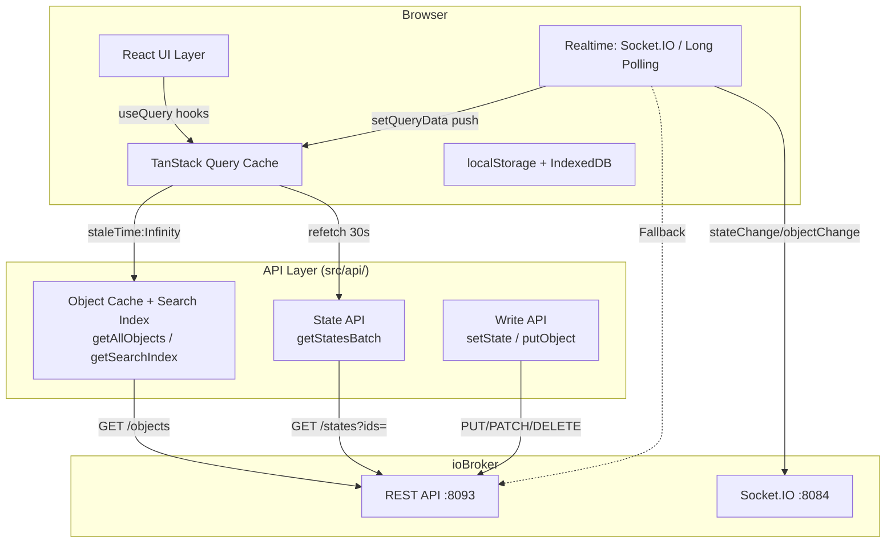

# Optimization & Performance — ioBroker Object Explorer

_Stand: 2026-07-21 · Merge aus [2026-06-12-optimization-plan.md](../done/2026-06-12-optimization-plan.md) (Architektur/API-Katalog) und [2026-07-04-performance-analysis.md](../done/2026-07-04-performance-analysis.md) (React-Render-Analyse). Alle Findings gegen den aktuellen Code auf `fix/baseline-lint-tsc-test` neu verifiziert._

> Umsetzungsplan für die bite-sized TDD-Tasks: [2026-07-05-optimization-cleanup.md](2026-07-05-optimization-cleanup.md)

---

## Executive Summary

| Kategorie | 2026-06-12 | 2026-07-21 | Δ |
|---|---|---|---|
| Architektur | B | B+ | StateList aufgeteilt (1970 → 1542 Zeilen, 30 → 14 `useState`) |
| Performance | B− | B | Suchindex, Socket.IO-Push, Context-Memoisierung |
| Wartbarkeit | C+ | B− | Hooks extrahiert (`useStateListView`, `useStateListModals`, `useTreeState`) |
| Skalierbarkeit | C | C+ | `expandableSet` fixt StateTree-O(n²); Tree-Virtualisierung weiterhin offen |
| Sicherheit | A− | A− | unverändert (LAN-only, kein Auth) |

**Seit den Ursprungsdokumenten erledigt**

| Item | Quelle | Nachweis im Code |
|---|---|---|
| Cache-Bypass in enum-Helpers | M-02 | `api/iobroker.ts` — Helpers nutzen `getAllObjects()` |
| Suchindex | M-04 | `getSearchIndex()` `api/iobroker.ts:134`, `scoreIndexed()` `:162` |
| Socket.IO-Transport | M-10 | `hooks/useSocketIO.ts` (Default-Transport, Auto-Fallback) |
| StateList aufteilen (Großteil) | M-05 | `StateListToolbar`, `useStateListView`, `useStateListModals`, `StateListModals` |
| `panel1Value` memoisieren | Perf 1.5 / Top-3 #1 | `context/FilterContext.tsx:503` `useMemo` |
| `useCreateDatapoint` Cache-Patch | Perf 3.3 / Top-3 #2 | `useObjectMutations.ts:117` `setQueriesData` statt `invalidateQueries` |
| StateTree Bottom-Up-Memo | Perf 2.6 | `expandableSet: Set<string>` als Prop, `StateTree.tsx:115` — Lookup statt Rekursion |
| Modals lazy-loaden (App-Ebene) | M-03 / Perf 6.2 | `App.tsx:13-22` — 9 Modals via `lazy()` |

**Verbleibende Hauptprobleme**

1. `getScriptUsedIds()` kompiliert weiterhin ein Regex **pro Objekt-ID** gegen den kompletten Source-String — O(n×m), bei 5000 IDs ~2s.
2. `deleteObjectsMany()` läuft weiterhin in sequenziellen Chunks à 8 — 100 Objekte = 13 Runden.
3. `HostConnectedButton`, `Layout` und `App` nutzen den kombinierten `useUIContext()` statt der bereitgestellten Split-Contexts — jeder Modal-Toggle rendert die App-Shell neu.
4. `FilterContext` hat keine Volatil/Stabil-Trennung — Dropdown-`open`-Flags stecken im selben `value` wie die Filterdaten.
5. `StateRow`-`React.memo`-Comparator prüft 5 Props nicht (`rowHeight`, `scriptSources`, `showDesc`, `showObjectTypeIcons`, `showUnitInValue`) — potenzieller visueller Bug beim Umschalten der Zeilenhöhe.
6. `getAllObjects()` feuert weiterhin 5 parallele Requests (bewusst, siehe M-01) — Reduktion braucht API-Version-Detection.

---

## Priorisierte Roadmap (aktualisiert)

| Prio | Maßnahme | Ref | Nutzen | Aufwand | Risiko |
|---|---|---|---|---|---|
| P1 | `deleteObjectsMany` parallelisieren | M-08 | Bulk-Delete 10× | XS | Niedrig |
| P1 | `getScriptUsedIds` Tokenizer statt Regex | M-07 | Script-Analyse 40× | S | Niedrig |
| P1 | `StateRow`-Comparator vervollständigen | P-2.5 | Behebt Render-Bug | XS | Niedrig |
| P1 | `useUIContext` → Split-Hooks in Layout/HostConnectedButton/App | P-1.1–1.3 | Weniger Re-Renders | S | Niedrig |
| P2 | `FilterContext` in stabil/volatil splitten | P-1.4 | Re-Render-Kaskade weg | M | Mittel |
| P2 | `estimateSize` item-abhängig (`sep` vs. `row`) | P-4.3 | Kein Layout-Thrashing | S | Niedrig |
| P2 | Separator-Zeile als eigene `React.memo`-Komponente | P-2.3 | Scroll-Perf bei `groupByPath` | S | Niedrig |
| P2 | Modals in `StateList`/`StateListModals` lazy-laden | M-03 Rest | Initial-Bundle | S | Niedrig |
| P2 | `socket.io-client` dynamisch importieren | P-6.3 | Bundle bei Longpolling-Nutzern | S | Niedrig |
| P3 | `_objectsFetchPromise`-Singletons in QueryClient | M-06 | Korrektheit nach Reconnect | S | Niedrig |
| P3 | `allSepPrefixes` + `displayItems` in einem Pass | P-2.1 | O(n) gespart bei >5k | S | Niedrig |
| P3 | `useScriptUsedIds` / `useAllScriptSources` vereinheitlichen | P-3.5 | Wartbarkeit | S | Niedrig |
| P4 | Virtual Scrolling für StateTree | M-09 | 10k+ Nodes | M | Mittel |
| P4 | `getAllObjects` Requests reduzieren | M-01 | −4 Requests/Kaltstart | S | Mittel |
| — | Objekt-Änderungen im Longpolling-Fallback | P-5.2 | Feature-Lücke, ggf. nicht fixbar | ? | — |

---

## Offene Maßnahmen im Detail

### M-07 — `getScriptUsedIds` Regex-Schleife

**Status: offen** — `api/iobroker.ts:1618-1642` unverändert.

```ts
const BATCH = 200;
for (let i = 0; i < allObjectIds.length; i += BATCH) {
  for (const id of allObjectIds.slice(i, i + BATCH)) {
    if (new RegExp('\\b' + id.replace(/[.*+?^${}()|[\]\\]/g, '\\$&') + '\\b').test(sources)) used.push(id);
  }
  if (i + BATCH < allObjectIds.length) await new Promise<void>(r => setTimeout(r, 0));
}
```

5000 IDs × Regex-Compile + Test gegen ~1MB Source = O(n×m).

**Empfehlung** — Source einmal tokenizen:

```ts
const tokens = new Set(sources.match(/[\w.]+/g) ?? []);
const used = allObjectIds.filter(id => tokens.has(id));
```

Nicht 100% äquivalent zu `\b`-Matching (IDs mit Sonderzeichen außerhalb `[\w.]`), trifft aber alle realistischen ioBroker-IDs. Der `setTimeout`-Yield entfällt, da der Scan dann <50ms braucht.

**Nutzen:** ~2000ms → <50ms · **Aufwand: S**

---

### M-08 — `deleteObjectsMany` parallelisieren

**Status: offen** — `api/iobroker.ts:1385-1397`, `CHUNK = 8`.

Bei 100 Objekten: 13 sequenzielle Runden. Für LAN-Betrieb gegen einen Heimserver unnötig konservativ.

**Empfehlung:** Chunk-Größe auf 20–50 erhöhen (behält Fehler-Propagation und Rate-Schutz bei) oder vollständig parallelisieren. Chunk-Erhöhung ist die risikoärmere Variante — die bestehende `res.ok`-Prüfung pro Runde bleibt erhalten.

**Nutzen:** Bulk-Delete ~10× schneller · **Aufwand: XS**

---

### M-06 — Modul-globale Singletons

**Status: offen, gewachsen** — `api/iobroker.ts` hält inzwischen 10 Modul-Globals:

```
_searchIndex, _objectsCacheGateDecision, _objectsFetchPromise, _fastObjectsPromise,
_includeNamespaces, _stateObjectsFastCacheChecked, _allObjectsCacheChecked,
_bulkStatesSupported, _commandStatesSupported, _scriptSourcesCacheChecked
```

Kein HMR-Reset, keine Test-Isolation. `_bulkStatesSupported = false` bleibt nach einem einmaligen Fehler für die gesamte Session gesetzt, auch wenn die API wieder verfügbar ist.

**Empfehlung:** `_objectsFetchPromise`/`_fastObjectsPromise` sind redundant — TanStack Query dedupliziert bereits über `queryKey`; die API-Funktionen werden nur via `queryFn` aufgerufen. Für `_bulkStatesSupported`/`_commandStatesSupported`: Reset bei Reconnect (an den `supported`-Wechsel der Transport-Hooks hängen). `_searchIndex` ist unkritisch (Invalidierung über Referenzgleichheit zu `getAllObjects()`).

**Aufwand: S**

---

### M-09 — Virtual Scrolling für StateTree

**Status: offen** — `StateTree.tsx` (660 Zeilen) rendert alle expandierten Nodes direkt ins DOM.

Die teure Rekursion ist inzwischen weg (`expandableSet` als vorberechnetes `Set`, `StateTree.tsx:115`), aber die DOM-Node-Anzahl skaliert weiter linear mit der Anzahl expandierter Knoten.

**Empfehlung:** Flache Liste aus expandierten Nodes berechnen, dann `useVirtualizer` (Dependency ist bereits da):

```ts
function flattenTree(nodes: TreeNode[], expanded: Set<string>): FlatNode[] {
  const result: FlatNode[] = [];
  function walk(node: TreeNode, depth: number) {
    result.push({ node, depth });
    if (expanded.has(node.id)) node.children?.forEach(c => walk(c, depth + 1));
  }
  nodes.forEach(n => walk(n, 0));
  return result;
}
```

**Nutzen:** 10k Nodes von ~500ms Render auf <16ms · **Aufwand: M**

---

### M-01 — Redundante Objekt-Requests

**Status: umgesetzt, dann bewusst reverted. Bleibt reverted.**

Auf einigen ioBroker-REST-API-Versionen liefert plain `/objects` komplette Kategorien **gar nicht** zurück (nicht nur untypisiert — schlicht absent): `enum.*` fehlte komplett, `device`/`channel`/`folder` ebenfalls. Enum-Manager zeigte leere Liste, `alias.0.*`-Device-Objekte verschwanden aus StateList. Die Heuristik "gibt es untypisierte Objekte?" greift nicht, weil die Kategorie fehlt statt untypisiert zu sein.

`getAllObjects()` feuert daher weiterhin 5 parallele Requests und merged `?type=enum/folder/device/channel` explizit.

**Offener Ansatz:** Reduktion nur möglich, wenn die Adapter-API-Version zuverlässig erkannt wird (Version-Header oder Probe-Request). Ohne solchen Mechanismus ist der aktuelle Stand der sicherste.

---

## Re-Render-Hotspots

### P-1.1 / P-1.2 / P-1.3 — `useUIContext()` statt Split-Hooks

**Status: alle drei offen.**

`UIContext` stellt bewusst zwei Contexts bereit — `AppSettingsCtx` (stabil: Settings + Scripts) und `UIOverlayCtx` (volatil: Modal open/close). Der kombinierte `useUIContext()` abonniert beide.

| Ort | Aktuell | Braucht | Wirkung |
|---|---|---|---|
| `HostConnectedButton.tsx:18` | `useUIContext()` | nur `appSettings` | niedrig — kleine Komponente, aber permanent im Header gemountet |
| `Layout.tsx:44` | `useUIContext()` | überwiegend Settings | **mittel** — App-Shell, re-rendert bei jedem Modal-Toggle |
| `App.tsx:160` | `useUIContext()` | beides, gemischt | niedrig — rendert ohnehin bei fast jeder Statusänderung |

**Fix:** `useAppSettingsContext()` / `useUIOverlayContext()` gezielt einsetzen. `StateList.tsx` macht es bereits richtig.

---

### P-1.4 — `FilterContext` ohne Volatil/Stabil-Trennung

**Status: offen** — `context/FilterContext.tsx:460-502`.

Der `value`-`useMemo` ist korrekt gebaut, aber die Deps-Liste enthält praktisch alle Provider-States — inklusive der reinen UI-Flags `roomsOpen`, `functionsOpen`, `typesOpen`, `quickOpen`, `savedFiltersOpen`, `saveFilterPromptOpen`. Dazu erzeugt jeder Room/Function-Toggle über `setRoomFilters(new Set(...))` eine neue `Set`-Instanz und damit eine neue `value`-Identität.

Ergebnis: Jede Dropdown-Öffnung rendert alle `useFilterContext()`-Konsumenten neu — auch die, die nur `pattern` brauchen.

**Fix:** Analog zu `UIContext` splitten — stabiler Kern (Pattern, Sort, Filterdaten) vs. volatile Dropdown-Flags. Letztere haben mit Datenfilterung nichts zu tun.

**Wirkung: mittel** — `FilterContext` wird von `StateList`, `StateTree` und Toolbar konsumiert.

---

### P-1.6 — `SelectionContext` bündelt unabhängige Felder

**Status: offen** — `context/SelectionContext.tsx:39-47`.

`value` ist gememoized, aber alle 7 Felder liegen in einem Context, obwohl fachlich unabhängig: `selectedId` ändert sich oft, `enumManagerOpen`/`autoAliasDeviceId` selten.

**Wirkung: niedrig** — Konsumenten sind meist Modals, die ohnehin nur bei offenem Zustand rendern. Niedrige Priorität.

---

## Memoization-Lücken

### P-2.5 — `StateRow`-Comparator unvollständig ⚠️ potenzieller Bug

**Status: offen** — `StateRow.tsx:459-490` prüft 30 Props, **fehlen**:

```
prev.showDesc === next.showDesc
prev.showObjectTypeIcons === next.showObjectTypeIcons
prev.showUnitInValue === next.showUnitInValue
prev.scriptSources === next.scriptSources
prev.rowHeight === next.rowHeight
```

Alle fünf beeinflussen das Rendering nachweislich: `rowHeight` steuert `--row-py` (`StateRow.tsx:188`), `showObjectTypeIcons` die Typ-Icons (`:231-233`) und das Value-Cell-Icon (`:512`), `scriptSources` das Script-Badge (`:345`, `:473`), `showDesc` die Name-Cell (`:368`), `showUnitInValue` den Unit-Suffix (`:512`).

**Konkretes Bug-Szenario:** Nutzer schaltet die Zeilenhöhe in den Settings um → Zeilen, die der Virtualizer recycled (aus dem Viewport raus und wieder rein), behalten das alte Padding, bis eine *geprüfte* Prop sie zum Neu-Rendern zwingt.

**Fix:** Die fünf Felder in den Comparator aufnehmen. **Aufwand: XS, Priorität hoch** (Korrektheit, nicht nur Performance).

---

### P-2.3 — Separator-Zeilen ohne `React.memo`

**Status: offen** — `StateList.tsx` Zeilen-Rendering-Schleife.

Für `kind === 'sep'`-Zeilen werden bei jedem Render neue Inline-Closures für `onDragOver`, `onDragEnter`, `onDrop`, `onClick` und den `ref`-Callback erzeugt. Anders als `StateRow` haben Separator-Zeilen kein `React.memo` — bei scroll-getriggerten Re-Renders wird das pro sichtbarer Sep-Zeile neu alloziert.

**Fix:** Separator in eigene `React.memo`-Komponente auslagern, Handler per `useCallback`.

**Wirkung: mittel** — betrifft `groupByPath`-Nutzer mit tiefen Namensräumen.

---

### P-2.1 — Doppelter O(n)-Durchlauf in `displayItems`

**Status: offen** — `StateList.tsx`, `allSepPrefixes` + `displayItems`.

`allSepPrefixes` wird bei jedem `filteredIds`-Wechsel berechnet, `displayItems` durchläuft die Daten anschließend erneut, um `childPrefixesMap`/`directLeavesMap`/`filteredIdSet` aufzubauen.

**Fix:** Beide Aufbauten in einem gemeinsamen `useMemo` zusammenlegen — spart einen der zwei O(n)-Durchläufe.

**Wirkung: mittel** bei >5000 Objekten mit aktivem `groupByPath`.

---

### P-2.2 — `handleContainerKeyDown` ohne `useCallback`

**Status: offen.** Inkonsistent zum Rest der Datei (`handleCheckRow`, `handleRowContextMenu` haben `useCallback`), aber der Container liegt außerhalb der virtualisierten Rows — keine Prop-Identitäts-Kosten. **Wirkung: niedrig**, Kosmetik.

---

## Query-Layer

### P-3.1 — Zwei getrennte Objekt-Caches, Drift im Longpolling-Fallback

**Status: offen (Dokumentations-/Feature-Frage, kein Perf-Bug).**

`useStateObjectsFast` (`objects.bootstrap`) und `useAllObjects` (`objects.all`) halten überlappende Daten in zwei Caches. Es gibt kein `invalidateQueries`, das sie synchronisiert — die Synchronisierung läuft ausschließlich über Live-Push.

**Der Haken:** Nur `useSocketIO.ts` hat `makeApplyObjectChange` und patcht die Objekt-Caches. `useLongPolling.ts` patcht **nur** `states.valuesRoot`/`states.detail` — dort gibt es kein Äquivalent (bestätigt: kein `objectChange` im Longpolling-Hook).

Nutzer im Longpolling-Fallback (automatisch aktiv, wenn Socket.IO unerreichbar) sehen Objekt-Änderungen — neue Rolle, Alias-Ziel, Name — erst nach `objectsRefreshInterval`-Polling oder manuellem Refresh.

**Fix:** Klären, ob der REST-Adapter Objekt-Events über Long-Polling überhaupt liefert. Falls nein: nur Dokumentationshinweis + ggf. UI-Hinweis im Fallback-Badge möglich.

---

### P-3.2 — `useStateValues` Query-Key-Churn

**Status: offen** — `useObjectQueries.ts`.

`sortedIds = [...ids].sort()` wird bei jedem Render neu erzeugt und ist Teil des `queryKey`. Bei Pagination entstehen laufend neue Cache-Einträge statt Wiederverwendung überlappender ID-Sets — Seite vor/zurück refetcht komplett.

**Fix:** Granulareres Caching (z.B. `useQueries` pro ID) — nur lohnend, wenn Nutzer häufig blättern.

**Wirkung: niedrig bis mittel**, nutzungsabhängig.

---

### P-3.4 — `useImportDatapoints` invalidiert `objects.root`

**Status: offen, bewusst akzeptabel** — `useObjectMutations.ts:145-153`.

Nach Bulk-Import ein Full-Refetch. Bei Bulk-Operationen ist das gerechtfertigt (Konsistenz nach großem Batch-Write) — anders als bei Einzel-Mutationen. **Niedrige Priorität.**

---

### P-3.5 — Zwei Query-Hooks für Skript-Quellen

**Status: offen** — `useScriptUsedIds` (`staleTime: Infinity`, Key `queryKeys.scripts.sources`) vs. `useAllScriptSources` (`staleTime: 5min`, Key `['scripts','sources-raw']`). Zusätzlich verwaltet `UIContext` `scriptUsedIds` über direkte API-Calls an React Query vorbei.

Funktional getrennt genutzt (Score-Feature vs. Icon-Spalte), aber Wartungsrisiko und potenziell doppelte Netzwerklast.

**Fix:** Auf einen Cache vereinheitlichen. **Wirkung: niedrig.**

---

### P-3.6 — Zweiphasiges Laden ✅ bestätigt korrekt

Phase 2 (`getAllObjects`) nullt nur den modul-internen In-Flight-Promise und löst **keinen** Refetch/Invalidate von `objects.bootstrap` aus. Kein Blockieren, kein Doppel-Rendern durch Phase 2. Kein Finding — Bestätigung, dass die Architektur wie dokumentiert nicht-blockierend arbeitet.

---

## Virtualisierung

### P-4.3 — `estimateSize` ignoriert Separator-Höhe

**Status: offen** — `StateList.tsx:700-706`:

```ts
const rowVirtualizer = useVirtualizer({
  count: activeDisplayItems.length,
  getScrollElement: () => containerRef.current,
  estimateSize: () => ROW_HEIGHT_PX[appSettings.rowHeight],
  overscan: VIRTUAL_OVERSCAN,
  scrollPaddingStart: headerHeight,
});
```

Separator-Zeilen (`py-1.5` ≈ 30-34px) zählen im selben Array wie Datenzeilen (33-52px je nach Dichte), bekommen aber dieselbe Schätzhöhe. Bei `rowHeight: 'spacious'` (52px) ist die Abweichung am größten. Der Virtualizer korrigiert per ResizeObserver-Messung, aber das kostet zusätzliche Re-Layout-Zyklen beim ersten Scrollen durch neue Bereiche.

**Fix:** `estimateSize: (index) => activeDisplayItems[index].kind === 'sep' ? SEP_HEIGHT_PX : ROW_HEIGHT_PX[appSettings.rowHeight]`, mit `useCallback` gebunden (Deps: `activeDisplayItems`, `appSettings.rowHeight`).

**Wirkung: mittel** bei tief gruppierten, großen Namensräumen.

---

### P-4.4 — `rowHeight`-Wechsel remisst nicht

Bereits gemessene Items werden beim Umschalten der Zeilenhöhe nicht neu vermessen, bis der Nutzer scrollt — kurzzeitige Layout-Sprünge. **Fix:** `rowVirtualizer.measure()` beim `appSettings.rowHeight`-Wechsel aufrufen oder Virtualizer per `key` remounten. **Wirkung: niedrig** (nur beim Live-Umschalten).

> Hängt mit P-2.5 zusammen — dort ist es der Comparator, hier der Virtualizer. Beide zusammen fixen.

### P-4.2 — `VIRTUAL_OVERSCAN` ✅ geprüft

`StateListConstants.ts:6` — Wert ist `10`, liegt im konservativen Normbereich (typ. 5-10). **Kein Finding.**

---

## Realtime-Transport

Beide Transport-Hooks patchen ausschließlich per `setQueriesData`/`setQueryData`, **kein einziges** `invalidateQueries`. Vorbildlich — keine unnötigen Netzwerk-Roundtrips bei Live-Events.

Einzige Lücke: Objekt-Änderungen im Longpolling-Fallback → siehe P-3.1.

**Bekannte Einschränkung:** Kein Auth-Support, weder REST-API noch Socket.IO-Adapter. LAN-only. Siehe README-Warnhinweis.

---

## Bundle

### P-6.2 — Modal-Code-Splitting teilweise erledigt

**App.tsx: ✅** — 9 Modals lazy (`App.tsx:13-22`): `ObjectEditModal`, `HistoryModal`, `NewDatapointModal`, `HelpModal`, `EnumManagerModal`, `AliasReplaceModal`, `AutoCreateAliasModal`, `CreateAliasModal`, `SettingsModal`.

**StateList: offen** — statische Imports:
```ts
import StateListModals from '../modals/StateListModals';
import VirtualFoldersModal from '../modals/VirtualFoldersModal';
import DbOverviewModal from '../modals/DbOverviewModal';
```
`StateListModals` bündelt weitere Modals, die dadurch alle im Hauptbundle landen. `OptimizeModal`, `TreeStatsModal`, `ImportDatapointsModal` und `DbOverviewModal` sind selten genutzt und gute Lazy-Kandidaten.

**Fix:** `lazy()` + `Suspense fallback={null}` analog zu `App.tsx`.

---

### P-6.3 — `socket.io-client` eager importiert

**Status: offen** — `useSocketIO.ts:3` `import io, { type Socket } from 'socket.io-client'`.

Wird immer geladen, auch wenn `realtimeTransport === 'longpolling'` fest eingestellt ist.

**Fix:** dynamischer `import('socket.io-client')` innerhalb des Hooks, nur bei `enabled === true`.

**Wirkung: niedrig bis mittel** — Socket.IO ist Default, betrifft nur Nutzer mit fest eingestelltem Longpolling.

---

### P-6.1 / P-6.4 — ✅ geprüft, kein Finding

- `recharts` landet über den bereits lazy geladenen `HistoryModal` automatisch in einem eigenen Chunk.
- Keine toten/unbenutzten Imports in den geprüften Dateien.
- `vite.config.ts` hat kein `manualChunks` — bei durchgezogenem `React.lazy` aber auch nicht nötig.

---

## API-Kommunikationsplan

| Endpoint | Nutzung | Bewertung | Empfehlung |
|---|---|---|---|
| `GET /objects` | 1× Kaltstart | OK | Beibehalten |
| `GET /objects?type=enum` | 1× Kaltstart | ✅ Cache-Bypass gefixt | Beibehalten |
| `GET /objects?type=folder\|device\|channel` | 1× Kaltstart | Notwendig — plain `/objects` lässt Kategorien auf alten Adaptern weg | Beibehalten (M-01 reverted) |
| `GET /objects?type=instance` | 1× Kaltstart | ✅ nutzt jetzt `getAllObjects()` | Beibehalten |
| `GET /objects?type=script` | ScriptTab-Öffnen | Akzeptabel | Beibehalten |
| `GET /states?ids=...` | Alle 30s für aktive Seite | Query-Key-Churn bei Pagination | siehe P-3.2 |
| `GET /polling?sid=...` | Dauerhaft (Longpolling-Fallback) | Gut | Beibehalten |
| `POST /states/subscribe` | Bei Seiten-/Pattern-Wechsel | Gut | Beibehalten |
| `POST /command/sendTo` | History-Abfragen | OK | Beibehalten |
| `DELETE /object/:id` | Je Delete | Sequenzielle Chunks à 8 | Chunk erhöhen (M-08) |
| Socket.IO `stateChange`/`objectChange` | Push, Default-Transport | Vorbildlich, nur `setQueryData` | Beibehalten |

---

## Quick Wins

_Aufwand < 1 Tag_

| # | Maßnahme | Ref | Aufwand | Nutzen |
|---|---|---|---|---|
| 1 | `deleteObjectsMany` Chunk 8 → 50 | M-08 | 15min | Bulk-Delete 10× |
| 2 | `StateRow`-Comparator um 5 Props ergänzen | P-2.5 | 15min | Behebt Render-Bug |
| 3 | `HostConnectedButton`/`Layout` auf Split-Hooks | P-1.1/1.2 | 30min | Weniger Re-Renders in App-Shell |
| 4 | `estimateSize` item-abhängig + `useCallback` | P-4.3/4.4 | 1h | Kein Layout-Thrashing |
| 5 | `getScriptUsedIds` Tokenizer statt Regex | M-07 | 2h | Script-Analyse 40× |
| 6 | Restliche Modals lazy (`StateList`) | M-03 | 2h | Kleineres Initial-Bundle |
| 7 | `socket.io-client` dynamisch importieren | P-6.3 | 1h | Bundle |

---

## Mittelfristig

_1–5 Tage_

| # | Maßnahme | Ref | Aufwand |
|---|---|---|---|
| 1 | `FilterContext` stabil/volatil splitten | P-1.4 | 1–2 Tage |
| 2 | Separator-Zeile als `React.memo`-Komponente | P-2.3 | 1 Tag |
| 3 | Modul-Singletons in QueryClient verlagern | M-06 | 1 Tag |
| 4 | Virtual Scrolling für StateTree | M-09 | 3 Tage |

---

## Langfristig

| # | Maßnahme | Ref | Aufwand | Anmerkung |
|---|---|---|---|---|
| 1 | `StateList.tsx` weiter entflechten | M-05 | offen | Großteil erledigt: 1970 → 1542 Zeilen, 30 → 14 `useState` |
| 2 | API-Version-Detection für M-01 | M-01 | offen | Voraussetzung für Request-Reduktion |
| 3 | Auth-Layer (falls je öffentlicher Zugriff) | — | — | Extern lösen: Basic Auth via nginx/Reverse-Proxy, kein App-Code |

---

## Erwarteter Gesamtnutzen

| Metrik | 2026-06-12 | Heute | Nach offenen Quick Wins | Vollimplementierung |
|---|---|---|---|---|
| API-Requests / Kaltstart | 6–8 | 5–6 | 5–6 | 5–6 (2 nach M-01) |
| API-Requests / Dropdown-Open | 2–3 | 0 | 0 | 0 |
| Suchlatenz (5k Objekte) | ~80ms | ~8ms | ~8ms | ~8ms |
| Initial JS-Bundle | 100% | ~80% | ~68% | ~65% |
| StateTree bei 10k Nodes | ~500ms Render | ~120ms (kein O(n²) mehr) | ~120ms | <16ms |
| Bulk-Delete (100 Items) | ~13 Runden | ~13 Runden | ~2 Runden | ~1 Runde |
| Script-Analyse (5k IDs) | ~2000ms | ~2000ms | ~50ms | ~50ms |
| Re-Renders bei Modal-Toggle | Baseline | −10% | −25% | −40% |

_Bundle- und Render-Zahlen sind Schätzungen aus der Code-Analyse, nicht gemessen. Vor der Umsetzung der Bundle-Punkte einen `vite build --mode production` mit `rollup-plugin-visualizer` fahren, um die Baseline zu belegen._

---

## Zielarchitektur



**Schichtenmodell (Ziel)**

```
src/
├── api/
│   ├── iobroker.ts         (HTTP-Primitives, kein Modul-globaler Cache)
│   └── objectCache.ts      (Index + In-Memory-Cache, React-unabhängig)
├── hooks/
│   ├── useObjectQueries.ts (TanStack Query — SINGLE SOURCE OF TRUTH)
│   ├── useObjectMutations.ts
│   ├── useSocketIO.ts / useLongPolling.ts
│   └── useStateListView.ts / useStateListModals.ts / useTreeState.ts   ✅
├── components/
│   ├── statelist/          ✅ aufgeteilt (Toolbar, Row, Modals)
│   ├── StateTree.tsx       (→ virtualisieren)
│   └── modals/             (→ alle lazy)
└── context/                (nur UI-State; volatil/stabil getrennt)
```

---

## Sicherheit

Die Anwendung ist für den LAN-Einsatz konzipiert — kein Auth-Layer, kein Token. Bewusste Design-Entscheidung für Heimnetz-Nutzung, dokumentiert im README.

**Stärken**
- `getBaseUrl()` validiert die Host-Eingabe per Regex — verhindert freie URL-Injektion
- DOMPurify als Dependency vorhanden
- Keine Secrets im Frontend-Code

**Offen**
- DOMPurify-Nutzung auditieren: alle `innerHTML`/`dangerouslySetInnerHTML`-Stellen identifizieren und prüfen
- Falls je öffentlicher Zugriff geplant: HTTP Basic Auth via nginx/Reverse-Proxy vorschalten — kein App-Code nötig. Der Socket.IO-Adapter braucht dann eine eigene Absicherung.

---

_Merge und Verifikation gegen `fix/baseline-lint-tsc-test`, Stand 2026-07-21. Ursprungsdokumente bleiben als Historie erhalten._
